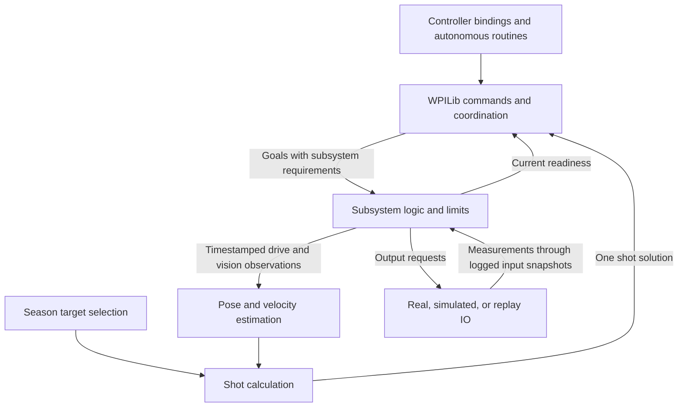

# Architecture review: preparing the robot software for 2027

Review date: September 23, 2026.

**Assessment:** the project uses a suitable architectural foundation for an FRC robot: WPILib commands and subsystems, constructor-supplied IO implementations, WPILib geometry and estimation, and AdvantageKit logging. Keep that foundation. Several implementation details undermine its intended behavior, so the current code should receive the high-priority corrections before reuse.

For a mentor deciding how much redesign to require, the recommendation is **focused repair and simplification**. A replacement framework would add substantial teaching and migration work without directly resolving the observed problems.

This assessment compares the local source with primary WPILib and AdvantageKit documentation. It is a source review, with no new build, simulator run, replay, or hardware trial. The project pins GradleRIO `2026.2.1` and AdvantageKit `26.0.1`; online documentation can describe newer releases. Check exact APIs against the selected dependencies during implementation. Nothing here certifies compatibility with a future 2027 release.

The [Mentor Recommendations](REUSE_RECOMMENDATIONS_2027.md) contain the detailed changes, acceptance procedures, and delivery plan. The [Technical Guide](TECHNICAL_GUIDE.md) explains the current code for readers learning robotics.

## What “following best practices” means here

There are three different sources of guidance:

| Basis | What it establishes | Example |
| --- | --- | --- |
| WPILib framework behavior and guidance | How its scheduler, subsystems, commands, and estimation APIs work | Commands declare the subsystems they control |
| AdvantageKit guidance | How to structure inputs and hardware access for this project's logging/replay approach | Read and log an IO input snapshot before using it |
| Engineering judgment for this team | Choices about maintainability, scope, teaching, and verification | Prefer a plain shooter coordinator; enforce one Java naming style |

WPILib presents a standard command-based structure while explicitly allowing other arrangements. Its template is a reference, not a requirement to reproduce every class name or helper. AdvantageKit is a separate FRC library with additional architectural guidance. A recommendation below should not be presented as an FRC competition rule or an endorsement by either project. [WPILib project structure](https://docs.wpilib.org/en/stable/docs/software/commandbased/structuring-command-based-project.html), [AdvantageKit overview](https://docs.advantagekit.org/).

The general robotics assessment uses concrete properties: predictable timing, clear hardware ownership, consistent units and coordinate frames, usable feedback, deliberate fault behavior, and observable results. It is an engineering assessment of this program, not a comparison against a universal robotics certification standard.

## Assessment by architectural area

“Aligned” means the approach is appropriate. It does not mean that every line has been tested. “Needs correction” identifies a specific implementation problem. The recommendation IDs link to the existing acceptance procedures.

| Area | Assessment | Local evidence and next step |
| --- | --- | --- |
| Application structure | Aligned overall | `Robot` handles lifecycle and scheduling; `RobotContainer` constructs mechanisms and configures bindings. Move its runtime odometry submission to the drive/estimator owner. [H2](REUSE_RECOMMENDATIONS_2027.md#acceptance-h2) |
| Commands and composition | Aligned approach; ownership needs correction | Command factories, `sequence`, `parallel`, and `alongWith` are appropriate. Manual hood bindings omit requirements. [H4](REUSE_RECOMMENDATIONS_2027.md#acceptance-h4) |
| Subsystem lifecycle | Needs correction | `Shooter.periodic()` manually updates children already registered with the scheduler. [H1](REUSE_RECOMMENDATIONS_2027.md#acceptance-h1) |
| Hardware abstraction | Strong foundation; contracts need correction | `FlywheelIO`, `ModuleIO`, and camera interfaces isolate hardware. Units and stop semantics differ between some adapters. [M3](REUSE_RECOMMENDATIONS_2027.md#acceptance-m3), [H8](REUSE_RECOMMENDATIONS_2027.md#acceptance-h8) |
| Pose estimation | Appropriate library; incomplete integration | Uses `SwerveDrivePoseEstimator`; submits cached measurements before refresh and discards supplied vision uncertainty. [H2](REUSE_RECOMMENDATIONS_2027.md#acceptance-h2), [H7](REUSE_RECOMMENDATIONS_2027.md#acceptance-h7) |
| Coordinate frames and units | Partially aligned | Uses `Pose2d`, `Rotation2d`, and `ChassisSpeeds`; heading resets and RPM/RPS boundaries need repair. [H3](REUSE_RECOMMENDATIONS_2027.md#acceptance-h3), [H6](REUSE_RECOMMENDATIONS_2027.md#acceptance-h6) |
| Shared state and dependencies | Useful intent; responsibilities need separation | `RobotState` holds an estimator, mutable velocity, and season target selection. [M2](REUSE_RECOMMENDATIONS_2027.md#acceptance-m2), [H9](REUSE_RECOMMENDATIONS_2027.md#acceptance-h9) |
| Mechanism coordination | Needs correction | Shooter parts use different calculation paths; readiness can describe an old request. [H5](REUSE_RECOMMENDATIONS_2027.md#acceptance-h5), [H6](REUSE_RECOMMENDATIONS_2027.md#acceptance-h6) |
| Simulation and replay | Good separation; incomplete execution | SIM has incomplete models; REPLAY has no container construction case. [H8](REUSE_RECOMMENDATIONS_2027.md#acceptance-h8) |
| Observability | Useful instrumentation; incomplete recording | Structured inputs and revision metadata exist; real-mode `WPILOGWriter` is disabled. [M4](REUSE_RECOMMENDATIONS_2027.md#acceptance-m4) |
| Autonomous integration | Incomplete | Active auto is a command composition. PathPlanner setup and chooser integration are disabled despite retained assets. [M5](REUSE_RECOMMENDATIONS_2027.md#acceptance-m5) |
| Season reuse | Needs separation | Field targets, calibrations, device configuration, and historical assets remain tied to 2026. [H9](REUSE_RECOMMENDATIONS_2027.md#acceptance-h9) |

## What the team should preserve

### A small Robot class and explicit construction

[Robot.java](src/main/java/frc/robot/Robot.java) starts logging, creates the container, runs the scheduler, schedules autonomous, and cancels autonomous on entry to teleop. [RobotContainer.java](src/main/java/frc/robot/RobotContainer.java) selects hardware implementations and installs bindings. This largely follows the responsibilities in the WPILib template. Keep mechanism-specific behavior outside `Robot`. [WPILib project structure](https://docs.wpilib.org/en/stable/docs/software/commandbased/structuring-command-based-project.html).

The control classes are a reasonable way to keep construction readable. Passing subsystem objects into their constructors makes dependencies visible. This is **dependency injection**: giving an object the collaborators it needs. No additional dependency-injection library is needed.

### IO interfaces and replaceable implementations

[Flywheel.java](src/main/java/frc/robot/subsystems/shooter/flywheel/Flywheel.java) takes a `FlywheelIO`, updates an input object, logs it, and uses that snapshot. Real and simulated adapters implement the interface. This matches AdvantageKit's recommended separation between control logic and hardware access. Its input payloads intentionally use public mutable fields and generated logging support. [AdvantageKit IO interfaces](https://docs.advantagekit.org/data-flow/recording-inputs/io-interfaces/).

In design-pattern terms, a real IO implementation acts as an **adapter** between the team's API and the motor vendor's API. Selecting a real or simulated implementation supplies interchangeable behavior through the same interface. The practical benefit is that students can change a device adapter without rewriting controller bindings or shot logic.

Preserve that boundary. Improve method units and behavior before adding more interfaces. An interface is useful only when its implementations honor the same contract.

### Command factories and compositions

Methods returning `Command`, and the existing sequential and parallel compositions, fit WPILib's model. WPILib explicitly supports combining commands this way. A separate Java class for every button action is unnecessary. [WPILib command compositions](https://docs.wpilib.org/en/stable/docs/software/commandbased/command-compositions.html).

The improvement is to make the factories clear and complete: name the intended action, declare the controlled resources, and define termination behavior. For example, the current `trackAndShootAtTargetFullRealCommandLatestGoodUseThisOne()` coordinates aiming and spin-up but does not feed a ball. A name such as `trackTargetCommand()` makes its actual responsibility teachable.

### Existing math and estimation libraries

Using WPILib geometry, swerve kinematics, and a swerve pose estimator is appropriate. Pose means the robot's position and heading. The estimator combines wheel/gyro movement with delayed vision measurements; the team should correct its inputs and configuration rather than write a replacement estimator. [WPILib pose estimators](https://docs.wpilib.org/en/stable/docs/software/advanced-controls/state-space/state-space-pose-estimators.html).

## Where the implementation breaks the intended design

### One owner must control each lifecycle and motor resource

WPILib runs registered subsystem `periodic()` callbacks before polling triggers and executing scheduled commands. `SubsystemBase` registers itself. [Scheduler sequence](https://docs.wpilib.org/en/stable/docs/software/commandbased/command-scheduler.html), [subsystem registration](https://docs.wpilib.org/en/stable/docs/software/commandbased/subsystems.html).

[Shooter.java](src/main/java/frc/robot/subsystems/shooter/Shooter.java) also calls `hood.periodic()`, `turret.periodic()`, and `flywheel.periodic()`. Those children already participate in the scheduler. Their input and simulation update paths therefore execute twice per main loop. Remove the additional calls. The plain `Module` helper objects in `Drive` have a different ownership model and still need their owner's explicit updates.

A related issue appears in [DriverControls.java](src/main/java/frc/robot/control/DriverControls.java): the manual hood `StartEndCommand` objects declare no hood requirement, while the default command also controls the hood. The scheduler arbitrates declared resources; it cannot infer ownership by inspecting a lambda. Read-only access to a measurement does not by itself require taking control of the mechanism. [WPILib subsystem resource management](https://docs.wpilib.org/en/stable/docs/software/commandbased/subsystems.html).

**Mentor recommendation:** keep the hood, turret, and flywheel as separately owned subsystems and make the shooter coordinator compose their commands. Each action must reserve the resources it actually controls. Do not assume that requiring the coordinator automatically reserves its children. Verify release, interruption, mode changes, and deliberate hold/stop behavior through H1 and H4.

### Estimation needs a coherent measurement path

The current call order is:

```text
Robot.robotPeriodic()
  RobotContainer.robotPeriodic()
    submit previously cached drive measurements with the current time
  CommandScheduler.run()
    Drive.periodic() refreshes drive measurements
    triggers and commands run
  FullSubsystem applies staged outputs
```

The cached values describe an earlier observation than the timestamp attached to them. Meanwhile, the higher-frequency update path in [Drive.java](src/main/java/frc/robot/subsystems/drive/Drive.java) is commented out. Moving the container call after the scheduler would still leave commands consuming an older estimate.

**Mentor recommendation:** give drive measurement refresh and odometry submission one owner. Preserve measurement timestamps, update measured chassis velocity, and expose the resulting state before dependent commands run. Do not rely on incidental registration order between unrelated subsystems. If vision/drive ordering needs coordination, define how timestamped observations are queued and incorporated.

[RobotState.java](src/main/java/frc/robot/RobotState.java) also ignores the `stdDevs` field of its vision measurement record. The estimator API has an overload that accepts these per-observation standard deviations, which express measurement uncertainty. Pass the already-calculated information through and verify its effect. [WPILib PoseEstimator API](https://github.wpilib.org/allwpilib/docs/release/java/edu/wpi/first/math/estimator/PoseEstimator.html).

H2, H3, and H7 provide the detailed checks. Source changes alone cannot establish physical localization accuracy.

### Custom output staging is a choice that needs a clear contract

[FullSubsystem.java](src/main/java/frc/robot/util/FullSubsystem.java) adds a callback after the scheduler. The turret uses it to apply outputs that commands have selected. Other mechanisms write through their IO methods directly.

The extra stage is a project extension. Its existence is not itself a WPILib violation. It can make the sequence “read inputs, choose goals, apply outputs” explicit, provided registration, disabled behavior, and cancellation all have clear owners. The current mixture raises the amount a student must remember when tracing a command.

**Mentor recommendation:** start with the simplest output policy that meets the mechanisms' needs. If staging is retained, document exactly when output requests take effect and who clears or replaces them. Give the participants an explicit lifecycle. Do not add a second scheduler or background command loop. Choose this policy before refactoring all mechanisms around it.

### Simulation and replay must preserve the control contract

[FlywheelIOSim.java](src/main/java/frc/robot/subsystems/shooter/flywheel/FlywheelIOSim.java) gives its PID controller an RPS target and RPM feedback. It also recomputes PID output every update even after an open-loop or stop request. These differences invalidate behavior comparisons with the real adapter.

WPILib simulation models advance from applied inputs to simulated sensor readings. An IO-based project can place that work inside its simulated adapter; moving everything into `simulationPeriodic()` is not required for this architecture. The essential review questions here are units, time step, and behavior at the interface. [WPILib physics simulation](https://docs.wpilib.org/en/stable/docs/software/wpilib-tools/robot-simulation/physics-sim.html), [AdvantageKit IO interfaces](https://docs.advantagekit.org/data-flow/recording-inputs/io-interfaces/).

REPLAY requires complete object construction as well as a saved input stream. Although `Robot` configures a replay source, `RobotContainer` has no corresponding construction case. A selectable enum value does not establish working replay. AdvantageKit also requires deterministic, synchronized inputs and recommends checking replay regularly. [AdvantageKit replay inputs](https://docs.advantagekit.org/getting-started/common-issues/non-deterministic-data-sources/).

**Mentor recommendation:** retain modest, trustworthy simulation coverage. Complete replay only if the team will use it; otherwise make its unsupported status explicit. Keep a single main-thread behavior pipeline. Any necessary background sensor sampling should hand synchronized input data to that pipeline. AdvantageKit documents this boundary and requires its logging calls on the main thread. [AdvantageKit multithreading](https://docs.advantagekit.org/getting-started/common-issues/multithreading/).

### State, targeting, and physical limits need distinct responsibilities

`RobotState` estimates location and chooses a 2026 hub target. `TrajectoryCalculator` reads shared robot state, while hood, turret, and flywheel tracking take different calculation paths. The resulting dependencies make it difficult to answer which exact pose and shot calculation produced a motor request.

**Mentor recommendation:** separate three responsibilities:

1. **State estimation:** current pose, measured velocity, measurement validity, and timestamps.
2. **Season strategy and shot calculation:** choose a target and calculate one `ShotSolution` from an explicit state snapshot and calibration.
3. **Mechanism control:** apply valid goals within physical bounds and report current readiness.

The mechanism must protect its limits regardless of whether a request originated from a button, autonomous routine, or calibration command. Readiness must describe the current request and current measurements. This is a team engineering requirement supported by the observed H5/H6 problems; WPILib cannot supply the physical travel limits or shot tolerances for this robot.

Shared state is reasonable when there is an explicit owner and controlled access. The singleton pattern is not automatically wrong. Here, constructor-supplied dependencies and defensive snapshots would make responsibilities clearer, particularly because `ChassisSpeeds` is mutable and currently returned directly. See M2 and H9.

## A practical target architecture

This is a proposed responsibility map, not a new framework or a claim that these classes already exist. Arrows show data or requests; `RobotContainer` constructs and connects the components.



Use this map to answer five questions in review:

| Question | Expected owner |
| --- | --- |
| What runs when the operator presses this button? | Controller binding and its command |
| Which code may control this motor? | Its subsystem, with command requirements governing competing actions |
| Where is the robot, and how fresh is that estimate? | One estimation owner with timestamped measurements |
| Which goal are we trying to reach? | The active command/coordinator and its explicit solution |
| How is that request translated to the installed hardware? | The selected IO adapter and robot-specific configuration |

For the initial 2027 foundation, prefer small classes and constructor parameters. Introduce a dedicated state machine only where mechanism transitions need one, such as unreferenced, homing, ready, and fault states. A full state-machine framework is unnecessary for a simple intake action. Retain high-frequency odometry only with synchronized samples and a measured benefit; a correct main-loop pipeline is a reasonable intermediate step.

The same review principles apply beyond FRC: isolate devices, make state transitions observable, define timing, and keep physical quantities explicit. WPILib supplies useful geometry and Java unit types. Its robot frame uses forward +X, left +Y, and up +Z; define transformations deliberately at sensor and field boundaries. [WPILib coordinate system](https://docs.wpilib.org/en/stable/docs/software/basic-programming/coordinate-system.html), [Java units library](https://docs.wpilib.org/en/stable/docs/software/basic-programming/java-units.html).

## Which recommendations are team preferences?

Keep these distinctions explicit when explaining the plan to students:

| Recommendation | Reason and authority |
| --- | --- |
| Declare requirements on motor-controlling commands | Needed for WPILib scheduler resource arbitration |
| Remove duplicate periodic calls | Correctness of this program's lifecycle and simulated timing |
| Preserve input timestamps and pass chosen vision uncertainty through | Correct use of the estimation design |
| Rename `kLoopPeriodSeconds` to `LOOP_PERIOD_SECONDS` | Team Java convention; WPILib examples also use `k` prefixes |
| Rename `TurretIO` to `TurretIo` | Team acronym policy; either spelling can implement the same architecture |
| Rename `Drive` to `Drivetrain` | Optional clarity improvement; `Drive` is already a valid Java class name |
| Prefer a plain shooter coordinator | Design recommendation for the current child-subsystem arrangement |
| Use Spotless and Checkstyle | Team enforcement workflow; neither establishes robot correctness |
| Add a large unit-test suite | Not required by this reuse plan; acceptance evidence is still required |

The proposed casing follows Google Java conventions. WPILib's own examples demonstrate different naming choices, so standardizing team code should be explained as a consistency decision. Preserve dependency names and narrowly identified generated sources. [Google Java naming](https://google.github.io/styleguide/javaguide.html#s5-naming), [WPILib command examples](https://docs.wpilib.org/en/stable/docs/software/commandbased/command-compositions.html).

## Recommended decision for the mentor

Approve the current **architectural direction** as the starting point for preseason work. Require the H1–H8 corrections and acceptance evidence for retained capabilities, then complete the H9 reuse boundaries and H10 team tooling requirements through the delivery plan. Keep medium-priority ownership, IO, and logging work alongside the fixes that depend on them.

When preparing the actual season application, compare carried code with the matching upstream templates and document deliberate differences. AdvantageKit publishes swerve and vision templates relevant to this project. Use the version appropriate to the selected season dependencies. [AdvantageKit templates](https://docs.advantagekit.org/getting-started/template-projects/).

The release decision should be based on demonstrations the team can repeat: one update per cycle, correct command ownership, consistent units and frames, deliberate stop/fault behavior, usable logs, and measured physical results. All remain subject to the linked acceptance procedures and the actual robot configuration.
