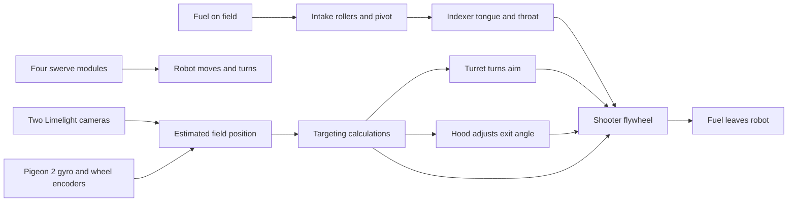
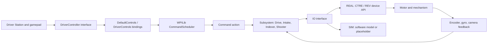

# Robot parts and control map

The [self-contained HTML tour](ROBOT_PARTS_AND_CONTROL_MAP.html) adds an interactive illustration. The [swerve diagrams](SWERVE_DRIVE_DIAGRAMS.md) explain the drivetrain in more detail.

This map describes parts selected by the 2026 **software**, not a verified inventory of the robot under modification. Fuel travels through the intake, indexer, and shooter; commands travel from a gamepad or autonomous routine through a subsystem and IO adapter to a motor controller. Sensors report measurements back.

The arrows show **intended relationships**, not proof that fuel transfer or targeting works. In particular, this software does not simulate fuel moving through the robot.

## The words you will meet in the code

| Word | Meaning on this robot |
| --- | --- |
| roboRIO | The computer that runs the Java robot program on the physical machine. The Driver Station enables modes and sends controller data to it. |
| Motor controller | Electronics that command a motor and can report sensor values. The code uses CTRE **Talon FX** and REV **SPARK MAX** objects; those are controllers, not the wheels or arms themselves. |
| Encoder | A sensor reporting rotation. The swerve modules use CANcoders for steering angle; other motor controllers also report position/velocity from their sensors. A relative encoder needs a trustworthy reference before its position means a physical angle. |
| Gyro | A sensor measuring the robot's turn/heading. The active REAL implementation uses a CTRE Pigeon 2. |
| CAN | The device communication bus used by the motor controllers and gyro. A CAN ID is an address in configuration, not a description of the physical mechanism. |
| Subsystem | A Java object representing one robot capability, such as `Drive` or `Intake`. It groups behavior and usually claims command ownership. |
| Command | An action the WPILib scheduler starts, repeats, and ends. A trigger, default command, or autonomous mode can schedule one. |
| IO adapter | A Java class that translates a subsystem's requests into real-device APIs or a simulated model. For example, `IntakeIOTalonFX` and `IntakeIOSim` both implement `IntakeIO`. |
| Pose | Estimated position **and** facing direction on the field. It is calculated from sensor measurements, so it can be wrong. |
| Open loop / closed loop | Open loop sends an output such as a percent of motor power. Closed loop asks for a target speed or position and uses measured feedback to correct the output. These are control modes, not guarantees of safe travel. |

WPILib describes commands, subsystem requirements, and default commands in its [command-based documentation](https://docs.wpilib.org/en/stable/docs/software/commandbased/subsystems.html). A command's requirements matter because the scheduler uses them to decide which actions may run at the same time.

## What parts does this program expect?

The diagram and table below are a **software-derived parts map**. They do not show exact physical placement, gear ratios, wiring, or the as-built 2027 robot. Those need a mechanical/electrical walk-through.

| Part or group | Job in plain language | Active Java path on the REAL robot | Device/API used in that path |
| --- | --- | --- | --- |
| Four swerve modules | Each corner has a wheel motor to drive and a steering motor to point that wheel. Coordinating all four lets the robot translate and turn. | [Drive.java](../src/main/java/frc/robot/subsystems/drive/Drive.java) → `Module` → [ModuleIOTalonFX.java](../src/main/java/frc/robot/subsystems/drive/ModuleIOTalonFX.java) | CTRE Phoenix 6 `TalonFX` for drive/steer, `CANcoder` for steering angle, `SwerveModuleConstants` for configuration; WPILib `SwerveDriveKinematics` turns robot velocity into wheel states. Four module positions are front-left, front-right, back-left, back-right. |
| Heading sensor | Reports robot rotation for field-relative driving and pose estimation. | `Drive` → [GyroIOPigeon2.java](../src/main/java/frc/robot/subsystems/drive/GyroIOPigeon2.java) | CTRE Phoenix 6 `Pigeon2` and status signals. |
| Intake pivot and rollers | Pivot positions the intake; rollers bring fuel in or send it back out. | [Intake.java](../src/main/java/frc/robot/subsystems/intake/Intake.java) → [IntakeIOTalonFX.java](../src/main/java/frc/robot/subsystems/intake/IntakeIOTalonFX.java) | Three Phoenix 6 `TalonFX` objects: left pivot, right pivot, roller/drive. The active buttons use open-loop pivot and roller commands. |
| Indexer tongue and throat | Moves fuel from inside the robot toward the shooter. | [Indexer.java](../src/main/java/frc/robot/subsystems/indexer/Indexer.java) → [IndexerIOTalonFX.java](../src/main/java/frc/robot/subsystems/indexer/IndexerIOTalonFX.java) | Two Phoenix 6 `TalonFX` objects; `index()` runs them at configured outputs while held. |
| Shooter turret | Turns the shooter left/right to aim. It does **not** turn the whole robot. | [Shooter.java](../src/main/java/frc/robot/subsystems/shooter/Shooter.java) → `Turret` → [TurretIOSparkMax.java](../src/main/java/frc/robot/subsystems/shooter/turret/TurretIOSparkMax.java) | REVLib `SparkMax`, `RelativeEncoder`, and `SparkClosedLoopController`; target position is sent with `ControlType.kPosition`. |
| Shooter hood | Changes the projectile exit angle up/down. | `Shooter` → `Hood` → [HoodIOSparkMax.java](../src/main/java/frc/robot/subsystems/shooter/hood/HoodIOSparkMax.java) | REVLib `SparkMax` and relative encoder; position control or open-loop output. |
| Shooter flywheel | Spins to launch fuel. Speed affects the shot. | `Shooter` → `Flywheel` → [FlywheelIOTalonFX.java](../src/main/java/frc/robot/subsystems/shooter/flywheel/FlywheelIOTalonFX.java) | Phoenix 6 `TalonFX` with a `VelocityVoltage` request and a velocity status signal. [Flywheel.java](../src/main/java/frc/robot/subsystems/shooter/flywheel/Flywheel.java) stores targets in RPM and converts before calling IO. |
| Two cameras | Observe AprilTags and send possible robot poses. They do not drive the motors directly. | [Vision.java](../src/main/java/frc/robot/subsystems/vision/Vision.java) → [CameraIOLimelight.java](../src/main/java/frc/robot/subsystems/vision/CameraIOLimelight.java), for `limelight-front` and `limelight-one` | Limelight NetworkTables topics (`tx`, `ty`, `botpose_wpiblue`, `botpose_orb_wpiblue`, orientation input). `Vision` filters observations before forwarding poses. |
| LED strip | Displays state-dependent patterns; it is feedback for people, not a motion mechanism. | [Leds.java](../src/main/java/frc/robot/subsystems/leds/Leds.java) | WPILib `AddressableLED` and `AddressableLEDBuffer`; constructed only in the REAL branch. |

The device IDs expected by Java are in [Constants.java](../src/main/java/frc/robot/Constants.java) and generated swerve settings in [DriveConstants.java](../src/main/java/frc/robot/subsystems/drive/DriveConstants.java). **Do not use this table to move hardware.** Ask the hardware mentor for the as-built wiring map, mechanical references, travel limits, and safe bring-up procedure first. The code's `Guts` subsystem, `GyroIONavX`, `ModuleIOTalonFXS`, and PhotonVision camera classes exist but are **not selected by the current `RobotContainer` construction path**.

## From a person's hand to a motor

The physical controller does not speak directly to a motor. [RobotContainer.java](../src/main/java/frc/robot/RobotContainer.java) constructs **two Xbox-style `DriverController` objects**, driver on USB port 0 and operator on USB port 1. [DriverController.java](../src/main/java/frc/robot/control/DriverController.java) wraps WPILib's `CommandXboxController`; PS4/PS5 wrapper classes are available but **not instantiated**. [DefaultControls.java](../src/main/java/frc/robot/control/DefaultControls.java) installs the normal drive command. [DriverControls.java](../src/main/java/frc/robot/control/DriverControls.java) binds buttons and triggers. [Robot.java](../src/main/java/frc/robot/Robot.java) calls the WPILib `CommandScheduler` in the repeating robot loop; the scheduler polls triggers and runs commands. WPILib explains this [scheduler sequence](https://docs.wpilib.org/en/stable/docs/software/commandbased/command-scheduler.html).

For one concrete example, moving the driver's left stick causes the **default** `DriveCommands.joystickDrive` action to read the axes. [DriveCommands.java](../src/main/java/frc/robot/commands/DriveCommands.java) applies a deadband and scaling, converts the requested field-relative movement using the current heading, and calls `Drive.runVelocity`. `Drive` calculates four wheel speed/angle requests with `SwerveDriveKinematics`; each `Module` sends them through `ModuleIO` to its motor controllers. Encoder and gyro readings return through those adapters and are logged. The robot aims to repeat this control process about every 20 ms, but actual timing can vary.

For another example, holding the operator's left bumper (while the left trigger is **not** held) schedules `Intake.intake()`. That command asks `IntakeIO` to run the intake roller; releasing the button ends the command and requests zero output. The REAL adapter calls `TalonFX.set(...)`. This example makes the distinction between a **command** (the action and its lifetime), a **subsystem** (intake behavior), and an **IO adapter** (the device call).

### Controls actually bound today

These are **software bindings**, not verified joystick behavior on a physical robot. “Hold” means a `whileTrue` binding; “press” means `onTrue`.

| Controller | Input | Code's intended action |
| --- | --- | --- |
| Driver, port 0 | Left stick / right-stick X | Default field-relative translation / rotation. |
| Driver | X press | Reset estimated heading and request gyro zero. The heading path is under review; do not assume the displayed pose is correct afterward. |
| Driver | B press | Request an X-shaped swerve stop. |
| Driver | D-pad directions, hold | `crabWalk` in a fixed direction, temporarily replacing default drive. |
| Operator, port 1 | Left bumper, hold, unless left trigger held | Intake rollers inward. |
| Operator | A, hold | Intake rollers outward. |
| Operator | X / Y, hold | Deploy / retract intake pivot at open-loop output. |
| Operator | Right bumper, hold | Track target with turret, hood, and flywheel. **This command does not itself feed the indexer.** |
| Operator | Right trigger, hold | Run indexer tongue and throat. This binding does **not** check shooter readiness. |
| Operator | D-pad up/down, hold | Manually move hood at small open-loop output; releases request zero. |
| Operator | D-pad left/right, hold | Manually move turret; releases request zero. |
| Operator | B press | Set turret's relative encoder position to zero. That is a software reference, not an independently measured mechanical home. |

The methods in `DriverControls.configureSingleController()` are **not called**. Commented-out controls are not active. The left trigger participates in the intake binding condition, but has no separate active action in `configureOperatorControls()`.

### Is there keyboard control?

The robot program binds **gamepad axes and buttons**, not keyboard letters. This checkout's [simgui-ds.json](../simgui-ds.json) contains keyboard-joystick definitions for WPILib's simulation Driver Station. Those keys can emulate joystick inputs **only if** the simulation GUI assigns an emulated joystick to the USB port and presents the axes/buttons expected by `CommandXboxController`. The file does not by itself prove that any particular keyboard key activates a named Xbox button or that a connected controller works. For a beginner's first SIM session, inspect the Driver Station joystick assignment and test one binding at a time while watching telemetry; avoid treating keyboard input as a separate code path.

## What happens when the robot starts and changes mode?

`Main` starts `Robot`, which extends AdvantageKit's `LoggedRobot`. `Robot` sets up logging, constructs `RobotContainer`, then repeatedly runs the container's state update, the command scheduler, and custom after-scheduler callbacks. Autonomous mode schedules `RobotContainer.getAutonomousCommand()`; teleoperated mode cancels that autonomous command so the controllers can take over. In test mode, `Robot.testInit()` cancels all commands.

`RobotContainer` makes one important decision based on [Constants.java](../src/main/java/frc/robot/Constants.java):

| Runtime | What is constructed | What this means for learning |
| --- | --- | --- |
| REAL, on roboRIO | Phoenix/REV adapters, Pigeon 2, two Limelight adapters, LEDs. | Code may address physical devices. The source cannot confirm their actual wiring, orientation, or safe limits. |
| SIM, on desktop by default | Simulated swerve modules, simulated turret/hood/flywheel, plus empty gyro and placeholder intake/indexer adapters. No `Vision` or `Leds` object. | A SIM startup or spinning wheel model does **not** verify fuel flow, camera behavior, field heading, or REAL motor responses. |
| REPLAY, if selected in desktop constant | `Robot` configures a log reader, but `RobotContainer` has no REPLAY construction case. | Replay is incomplete; do not expect a working robot from this option. |

Within each subsystem, the **same behavior class** receives either a REAL or SIM implementation of an IO interface. AdvantageKit's [IO-interface guide](https://docs.advantagekit.org/data-flow/recording-inputs/io-interfaces/) explains this pattern. Here, `@AutoLog` input classes feed `Logger.processInputs(...)` so readings can be inspected. `Logger` publishes to NetworkTables in REAL/SIM; the REAL `WPILOGWriter` line in `Robot.java` is currently commented out, so a persistent robot log is not established by this configuration.

## How aiming uses sensors

Wheel motion and gyro heading feed [RobotState.java](../src/main/java/frc/robot/RobotState.java), which owns a WPILib `SwerveDrivePoseEstimator`. The two REAL Limelights may submit field-pose observations through `Vision` and a `VisionConsumer` callback. `RobotState.getShooterTarget()` currently chooses the alliance-adjusted hub point. The turret points toward that target based on estimated pose; hood and flywheel target values are computed from target distance or [TrajectoryCalculator.java](../src/main/java/frc/robot/subsystems/shooter/TrajectoryCalculator.java).

This is an **intended data flow, not a certified aiming system**. The current `Drive` has a high-rate odometry loop whose call into `RobotState` is commented out; `RobotContainer.robotPeriodic()` instead sends a current wheel-position/gyro observation. `Vision` computes uncertainty values, but `RobotState.addVisionMeasurement()` currently calls an estimator overload without passing them. The SIM branch has no vision object and uses an empty `GyroIO`. These details matter when someone sees a moving field graphic or a calculated shot: a displayed estimate is not independent proof of field accuracy. The [Architecture Review](ARCHITECTURE_REVIEW.md) and [2027 Recommendations](REUSE_RECOMMENDATIONS_2027.md) explain the repairs and acceptance criteria.

## Which third-party libraries matter here?

| Library | Role in this code | First classes to recognize |
| --- | --- | --- |
| [WPILib](https://docs.wpilib.org/en/stable/) | FRC robot lifecycle, Driver Station/gamepad interface, command scheduler, drive math, geometry, simulation models, dashboard, and LED APIs. | `CommandScheduler`, `CommandXboxController`, `Commands`, `SubsystemBase`, `SwerveDriveKinematics`, `SwerveDrivePoseEstimator`. |
| [CTRE Phoenix 6](https://v6.docs.ctr-electronics.com/) | Talks to Talon FX motor controllers, CANcoders, and Pigeon 2 on REAL; supplies generated swerve configuration types. | `TalonFX`, `CANcoder`, `Pigeon2`, `StatusSignal`, `VelocityVoltage`, `PositionVoltage`. |
| [REVLib](https://docs.revrobotics.com/revlib/) | Talks to SPARK MAX controllers for hood and turret on REAL. | `SparkMax`, `RelativeEncoder`, `SparkClosedLoopController`, `SparkMaxConfig`. |
| [AdvantageKit](https://docs.advantagekit.org/) | `LoggedRobot`, sensor/input logging, telemetry publication, and the IO abstraction used throughout this project. | `LoggedRobot`, `Logger`, `@AutoLog`, `NT4Publisher`. |
| [PathPlannerLib](https://pathplanner.dev/) | Library for planned autonomous paths, present as a dependency and in inactive setup code. | `NamedCommands`, `AutoBuilder`; the active autonomous entry point does **not** select a stored PathPlanner path. |
| [PhotonVision](https://docs.photonvision.org/) | Alternative camera implementation included in source and vendor dependency. | `PhotonCamera`, `CameraIOPhotonVision`; **not constructed** by this robot's active REAL/SIM branches. |
| Studica vendor dependency | Available in `vendordeps`, with a `GyroIONavX` adapter in source. | The active REAL heading adapter is `GyroIOPigeon2`, not navX. |

The installed dependency versions are recorded in [vendordeps](../vendordeps/) and [build.gradle](../build.gradle). A dependency's presence does not mean its hardware is installed or its API is called by the active path. For controller terminology, see the official [WPILib trigger bindings](https://docs.wpilib.org/en/stable/docs/software/commandbased/binding-commands-to-triggers.html); for REV position control, see [REVLib closed-loop control](https://docs.revrobotics.com/revlib/spark/closed-loop/closed-loop-control-getting-started).

## Explore one control path

Trace the operator's intake button through `DriverControls` → `Intake.intake()` → `IntakeIO` → `IntakeIOTalonFX`, then follow a sensor value back through `updateInputs()`. Compare the REAL and SIM adapters in `RobotContainer` to see which desktop behaviors are modeled. Before testing hardware, compare this software map with the actual robot and its approved bring-up procedure.
