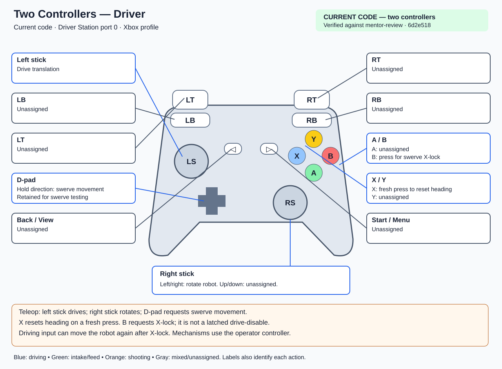
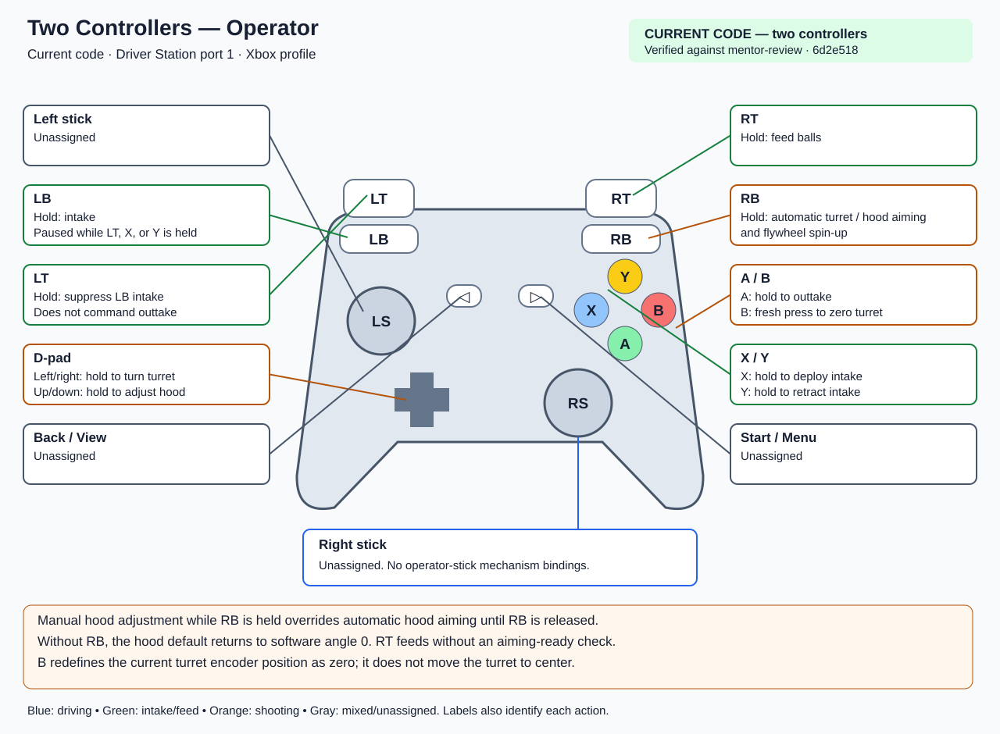
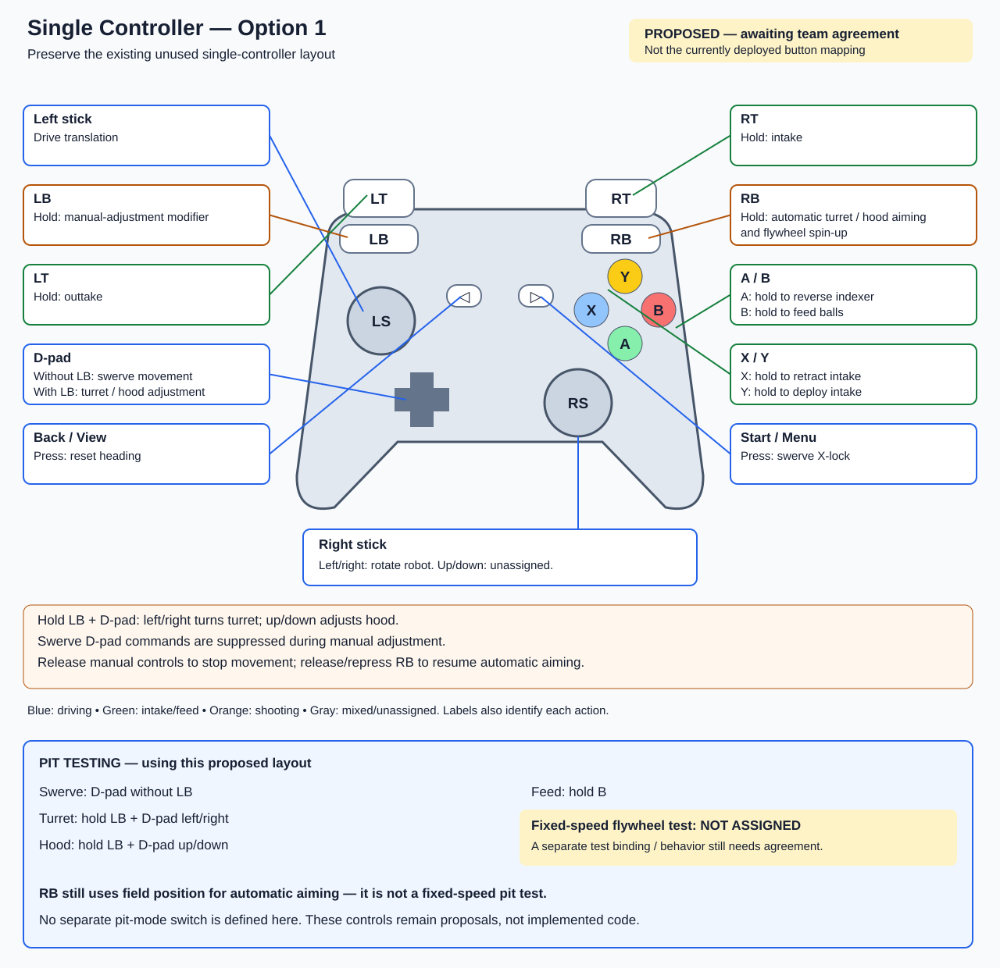
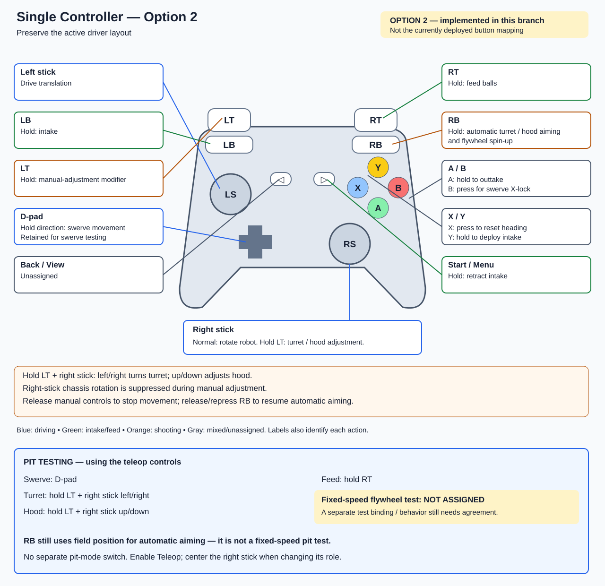
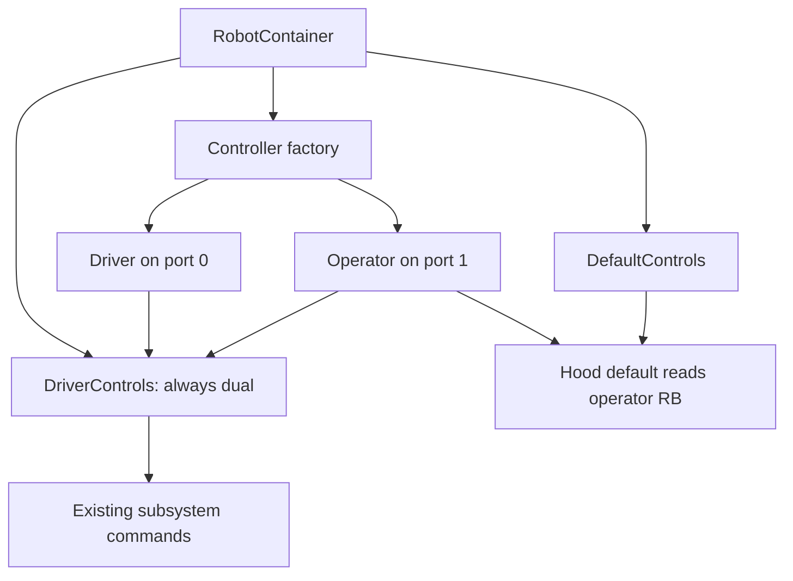
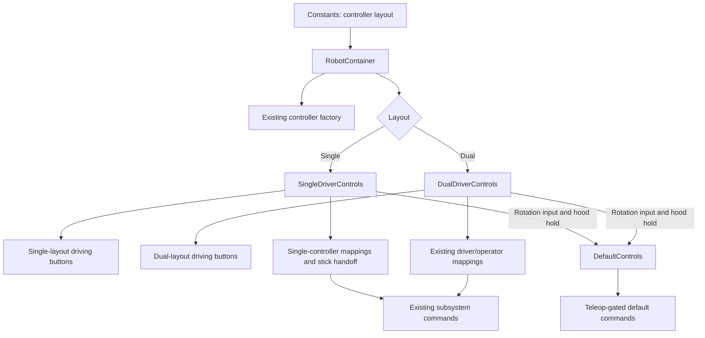

# Controller configurations and single-controller options for CKI

**October 17, 2026 event reference.** Option 2 is implemented and selected in this branch. The existing two-controller layout remains available. Option 1 is retained for comparison only. Physical controller acceptance is still pending.

The two-controller mappings were checked against `origin/mentor-review` at `6d2e518`. Option 2 is implemented on `feature/single-controller-layout`.

## WhatsApp sharing

Full-resolution PNG images:

- [Current driver controller](assets/two-controller-driver.png)
- [Current operator controller](assets/two-controller-operator.png)
- [Proposed single controller — Option 1](assets/single-controller-option-1.png)
- [Selected single controller — Option 2](assets/single-controller-option-2.png)

## Current configuration — two controllers

With `TWO_CONTROLLERS` selected, `DualDriverControls.configure()` enables separate driver and operator bindings. The code configures the driver on **Driver Station USB port 0** and the operator on **port 1**. Both real-controller profiles are currently Xbox; profiles can be configured separately, and SIM uses Xbox-style inputs.

### Driver — port 0

[Open the editable driver diagram](assets/two-controller-driver.svg).

### Operator — port 1

[Open the editable operator diagram](assets/two-controller-operator.svg).

### Complete current mapping

These are enabled-teleop controls. “Hold” means the command is requested while the input is held; a released hood manual command can transition to position hold or the default zero-angle target as explained below.

| Control | Driver — port 0 | Operator — port 1 |
| --- | --- | --- |
| Left stick | Drive translation | Unassigned |
| Right stick left/right | Rotate robot | Unassigned |
| Right stick up/down | Unassigned | Unassigned |
| D-pad up/down | Hold: forward/backward swerve movement | Hold: manual hood movement |
| D-pad left/right | Hold: sideways swerve movement | Hold: manual turret movement |
| D-pad diagonals | Hold: diagonal swerve movement | Unassigned |
| LB | Unassigned | Hold: intake, unless LT, X, or Y is held |
| RB | Unassigned | Hold: automatic turret/hood aiming and flywheel spin-up |
| LT | Unassigned | Suppresses LB intake while held; no separate motor command |
| RT | Unassigned | Hold: feed balls, independently of aiming readiness |
| A | Unassigned | Hold: intake outtake |
| B | Press: swerve X-lock | Fresh press: redefine turret encoder zero |
| X | Fresh press: reset heading | Hold: deploy intake |
| Y | Unassigned | Hold: retract intake |
| Back / View | Unassigned | Unassigned |
| Start / Menu | Unassigned | Unassigned |
| Stick clicks | Unassigned | Unassigned |

### Current behavior that matters

- **Driver D-pad is reserved for swerve movement/testing.** The operator has a separate D-pad for mechanism adjustment.
- **Operator X deploys and Y retracts.** The old, unused single-controller method had these actions reversed. Do not treat its assignments as the current operator mapping.
- **Intake collection pauses during pivot movement.** If LB remains held, releasing X/Y resumes collection once LT is also released.
- **Operator RT feeds manually.** It does not wait for flywheel, turret, and hood readiness.
- **RB starts three separate tracking commands.** Moving the hood with the operator D-pad while RB is held latches a manual hood override. After the D-pad is released, the hood holds its last measured angle while RB remains held. Releasing and pressing RB again restores automatic hood aiming.
- **The hood default returns to software angle `0` when RB is not held.** Therefore, a manual hood angle is not retained indefinitely after releasing its control. Software zero is not a verified physical horizontal angle.
- **Manual turret adjustment interrupts turret tracking.** Releasing the D-pad stops manual output; if RB stayed held, release and press it again to request tracking again.
- **Driver B requests X-lock, not a persistent drive-disable mode.** Driving commands can move the robot again. X-lock is not a mechanical brake.
- **Operator B zeros the turret encoder at its current position; it does not center the turret.** Use only at the correct physical reference. Turret zero and driver heading reset require a fresh press in enabled teleop rather than a button held through enable.

Xbox names are used in the diagrams. Supported PlayStation adapters map A/B/X/Y to Cross/Circle/Square/Triangle, LB/RB to L1/R1, and LT/RT to L2/R2. Driver and operator controller types need not match.

## Single-controller layouts

Option 2 is selected and implemented. Option 1 remains an alternative proposal. Both layouts reserve the D-pad for swerve movement/testing.

## Option 1 — preserve the existing unused single-controller layout

Keep the existing intake, feeding, and automatic shooting buttons. Use the currently unassigned LB as a manual-adjustment modifier, and restore unmodified D-pad swerve controls.

[Open the standalone diagram](assets/single-controller-option-1.svg).

- Hold **LB + D-pad left/right** to turn the turret manually.
- Hold **LB + D-pad up/down** to adjust the hood manually.
- Without LB, the D-pad operates swerve movement/testing.
- Y deploys the intake only; remove its conflicting turret-zero binding.

## Option 2 — implemented: preserve the active driver layout

Keep the driver's normal stick movement, D-pad swerve controls, X heading reset, and B X-lock. Add the mechanism controls to the remaining inputs.

[Open the standalone diagram](assets/single-controller-option-2.svg).

- Hold **LT + right stick left/right** to turn the turret manually.
- Hold **LT + right stick up/down** to adjust the hood manually.
- While LT is held, the right stick must not also rotate the chassis.
- Independent indexer reverse is not assigned yet. Intake outtake on A is a different function.

## Pit testing with either proposal

Each single-controller diagram includes a pit-testing panel. Option 2 uses the implemented teleop controls for these tasks; it does not introduce a separate pit-mode switch. Enable Teleop, not the Driver Station Test mode, to use them.

| Pit task | Option 1 | Option 2 |
| --- | --- | --- |
| Swerve movement/testing | D-pad without LB | D-pad |
| Manual turret | Hold LB + D-pad left/right | Hold LT + right stick left/right |
| Manual hood | Hold LB + D-pad up/down | Hold LT + right stick up/down |
| Feed balls | Hold B | Hold RT |
| Fixed-speed flywheel test | **Not assigned — needs agreement** | **Not assigned — needs agreement** |

**RB still requests field-based automatic aiming.** Neither option yet provides a complete fixed-speed shooting test independent of field position. The manual turret/hood controls and feeding do not themselves provide flywheel spin-up. The earlier isolated pit-test draft is separate and conflicts with the required swerve testing, as noted below.

## Side-by-side mapping

Option 1 is proposed; Option 2 is implemented. “Hold” means request the action while held and stop that request on release. Physical stopping depends on mechanism inertia and braking. “Press” means a deliberate new button press.

| Control | Option 1 | Option 2 |
| --- | --- | --- |
| Left stick | Drive translation | Drive translation |
| Right stick left/right | Rotate robot | Rotate robot normally; manual turret while LT held |
| Right stick up/down | Unassigned | Manual hood while LT held |
| D-pad without modifier | Hold: swerve movement/testing, including diagonals | Hold: swerve movement/testing, including diagonals |
| LB | Hold: D-pad manual-adjustment modifier | Hold: intake |
| LB + D-pad left/right | Hold: manual turret | No special combination; LB and D-pad retain their individual actions |
| LB + D-pad up/down | Hold: manual hood | No special combination; LB and D-pad retain their individual actions |
| RB | Hold: automatic turret/hood aiming and flywheel spin-up | Hold: automatic turret/hood aiming and flywheel spin-up |
| LT | Hold: outtake | Hold: right-stick manual-adjustment modifier |
| RT | Hold: intake | Hold: feed balls |
| A | Hold: reverse indexer | Hold: outtake |
| B | Hold: feed balls | Press: swerve X-lock |
| X | Hold: retract intake | Press: reset heading |
| Y | Hold: deploy intake only | Hold: deploy intake only |
| Back / View | Press: reset heading | Unassigned |
| Start / Menu | Press and release: swerve X-lock | Hold: retract intake |
| Turret zero | Separate deliberate setup action; interface not decided | Separate deliberate setup action; interface not decided |

Back/Start are the labels in the supplied Xbox-style reference image. View/Menu are the corresponding names on newer Xbox controllers. Start/Menu is now exposed by `DriverController` (Options on PlayStation). Back/View remains unassigned and is not exposed. Connect and Guide are not proposed robot controls; stick clicks are also unassigned in these proposals.

## Usability comparison

| Consideration | Option 1 | Option 2 |
| --- | --- | --- |
| Familiarity | Closest to the old unused single-controller method | Preserves the active driver controls |
| Driving while collecting | Thumbs on sticks; right finger holds RT | Thumbs on sticks; left index finger holds LB |
| Feeding while steering | B requires the right thumb to leave the steering stick | RT leaves both thumbs on the sticks |
| Shooting grip | Hold RB and B | Hold RB and RT: usually right index on RB and middle finger on RT |
| Manual aiming | Left index on LB; left thumb on D-pad, away from driving stick | Left index on LT; right thumb on right stick, temporarily replacing chassis rotation |
| Intake deployment/retraction | Right thumb moves to Y/X | Right thumb moves to Y/Start; Menu reach should be tried on the actual controller |
| Outstanding mapping | Turret-zero setup interface | Indexer reverse and turret-zero setup interface |

**Selected approach:** Option 2 preserves the driver's familiar controls and permits feeding with both thumbs on the sticks. The driver still needs to try holding RB and RT together; independent indexer reverse is not assigned. Neither layout makes every simultaneous action equally comfortable.

## Implemented Option 2 behavior

- Only one layout registers bindings. In single mode, port 1 has no action bindings and hood defaults use driver input.
- Bindings use the existing enabled-teleop checks. Held mechanism buttons can activate when teleop starts, as in dual mode. Shared-stick movement requires centering after enable or a role change. Broader connection/rearming policy is deferred for both layouts.
- LT stops chassis rotation from the right stick. When pressing or releasing LT with the stick displaced, center the right stick before using its new role. Left-stick translation and D-pad swerve remain available while LT is held.
- Right-stick manual outputs use a 0.1 deadband and existing manual output limits. Up requests the same hood direction as the existing operator D-pad up. Confirm physical direction on the robot.
- LT interrupts automatic turret/hood aiming. Releasing LT with RB still held does not restart aiming; release and press RB again. RB flywheel tracking remains independent.
- Centering the manual stick holds the hood's measured position. Releasing LT preserves that hold while RB remains held; otherwise the hood returns to software zero. Software zero is not a verified physical horizontal reference.
- Y/Start pivot controls pause rollers. Pressing both requests no pivot movement. A outtake takes priority over LB collection; releasing pivot/outtake resumes collection if LB remains held.
- RT feeds manually without a readiness gate, consistent with the dual-controller operator feed.
- X resets heading only on a fresh enabled press. Y never zeros the turret.
- Leaving enabled teleop cancels while-held manual commands through their existing end actions. Manual bindings do not run in Autonomous or Test mode.

## Selecting the layout

Set `Constants.kControllerLayout` to `SINGLE_CONTROLLER` (Option 2, current selection) or `TWO_CONTROLLERS`, then rebuild and restart/redeploy. This is independent of the existing driver/operator hardware profile settings. It is not a dashboard mode switch.

SIM uses Xbox-style input on port 0. Start/Menu is Xbox button 8. Center the right stick after enabling or changing its role before using it.

## Changing a button assignment

Single-controller mechanism bindings are in `SingleDriverControls.configureMechanismControls()`. They use the same direct `driver.button().and(DriverStation::isTeleopEnabled)` pattern as the dual-controller bindings. When remapping a button, also update its uses in intake priority checks, the manual-aim override, and hood holding or stick-role checks where applicable.

Each class contains its own heading reset, X-lock, and D-pad assignments in `configureDriverControls()`. Dual-controller operator mappings remain in `DualDriverControls.configureOperatorControls()`. Neither layout calls the other layout. The single-controller stick-role check is registered before its action bindings; the existing binding registration order is preserved.

Choose an unused button or swap assignments so two actions do not share a button unintentionally. Update the diagram and controller tests when changing a mapping. Axis-role behavior and output limits are separate from simple button remapping.

## Before and after design

Before this change, initialization always registered driver and operator bindings, and the hood default always read operator RB:

After this change, `RobotContainer` selects one controls class. Each class provides the rotation input and hood-hold condition used by `DefaultControls`:

## Verification and remaining checks

- Six HAL joystick/scheduler tests exercise Option 2 transitions, simultaneous controls, disable behavior, autonomous ownership, heading reset/X-lock, and the retained dual-controller bindings.
- A temporary headless check constructed the actual `RobotContainer` with `SimRobotWiring` and exercised RB tracking, LT manual adjustment, release, and disable. The temporary probe is not part of the committed test suite.
- The intake tests record motor requests because this base branch still has an empty intake SIM adapter; they do not simulate fuel collection.
- Critical review checks command ownership and shared-stick handoff.
- Physical controller grip, manual direction, hood startup reference, and real mechanism behavior remain unverified. The desktop checks do not validate an entire autonomous route or real-robot stopping time.

## Decisions for Brendan and Maxwell

1. Try Option 2 on the actual controller: driving, collecting, aiming, and feeding together.
2. Is the RB + RT grip comfortable for Option 2?
3. Is independent indexer reverse required, and if so, what should its binding be in Option 2?
4. Are hold-to-deploy/retract intake controls appropriate for the team's workflow?
5. Does the documented hood hold/return behavior fit the workflow, and how should deliberate turret zeroing be exposed?

These mappings do **not** resolve automatic aiming from an incorrect field position. RB still requests field-based aiming. Fixed-speed pit shooting is a separate deferred feature. The local `feature/pit-test-controls` draft at `f590974` repurposes the D-pad and suppresses driving, so it does not satisfy Maxwell's swerve-testing requirement and must not be treated as either option documented here.

## Code references and diagram provenance

- [DualDriverControls.java](../src/main/java/frc/robot/control/DualDriverControls.java): complete dual-controller bindings.
- [SingleDriverControls.java](../src/main/java/frc/robot/control/SingleDriverControls.java): complete single-controller mappings, manual-aim override, and right-stick handoff.
- [DefaultControls.java](../src/main/java/frc/robot/control/DefaultControls.java): joystick driving and default turret/hood behavior.
- [DriverController.java](../src/main/java/frc/robot/control/DriverController.java): shared Xbox/PS4/PS5 inputs.
- [DriverControllerFactory.java](../src/main/java/frc/robot/control/DriverControllerFactory.java): controller profile selection.

The SVG diagrams are newly drawn, editable schematics following the button arrangement in the controller image supplied in the discussion. They do not embed or reproduce that image. Its original source and attribution were not provided. Colors group functions, but every action is also identified in text. The table above provides the complete text equivalent of all four diagrams.
