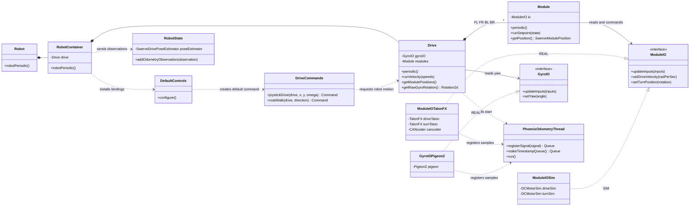
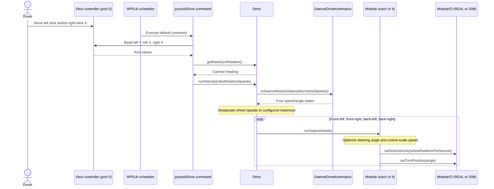
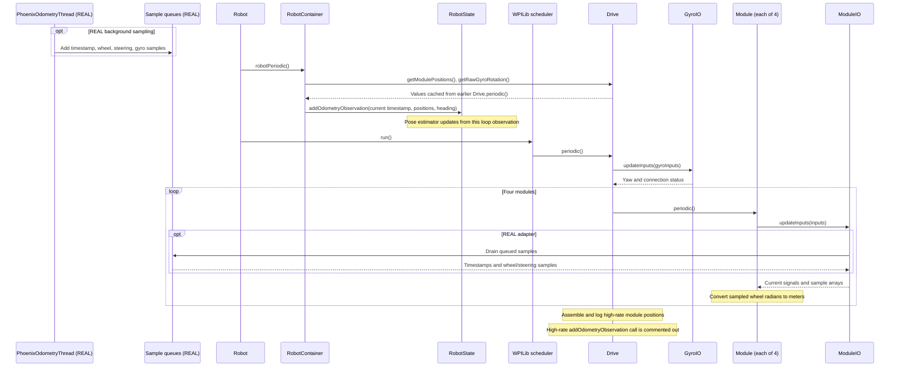

# Swerve drive: class and sequence diagrams

These diagrams describe the **current 2026 source**, as it stands before the proposed 2027 repairs. They are for understanding control flow, not proof that the modified physical robot drives or estimates its field position correctly. Start with the [Robot Parts and Control Map](ROBOT_PARTS_AND_CONTROL_MAP.md) if terms such as *module*, *gyro*, or *encoder* are new. The [Technical Guide](TECHNICAL_GUIDE.md#7-swerve-drive) explains the drive calculations in more depth.

**The physical idea:** each of four swerve modules has a drive wheel and a steering axis. The driver asks for whole-robot translation and rotation. Software computes a speed and steering angle for each module. Encoders and a gyro report what happened; the program uses those readings to estimate position.

| Diagram symbol | Read it as |
| --- | --- |
| `A *-- B` in the class diagram | `A` owns or constructs `B` objects. |
| `A ..> B` | `A` uses or calls `B`. |
| `Implementation ..|> Interface` | The implementation fulfills that interface. |
| Solid arrow in a sequence diagram | An actual call or message in the current path. |
| Note in a sequence diagram | A timing or implementation qualification; it is not an additional call. |

## 1. Class diagram: who owns what?

`RobotContainer` selects the **REAL** implementations (`GyroIOPigeon2` and four `ModuleIOTalonFX` objects) or the **SIM** implementations (an empty `GyroIO` and four `ModuleIOSim` objects). It passes them to one `Drive` constructor in front-left, front-right, back-left, back-right order. `Drive` wraps each module adapter in a `Module` object. `ModuleIO` and `GyroIO` are team-owned interfaces; Talon FX, CANcoder, Pigeon 2, `DCMotorSim`, kinematics, and the pose estimator are third-party APIs. [RobotContainer.java](../src/main/java/frc/robot/RobotContainer.java), [Drive.java](../src/main/java/frc/robot/subsystems/drive/Drive.java), [Module.java](../src/main/java/frc/robot/subsystems/drive/Module.java).

The class diagram shows dependencies, **not call order**. It also simplifies generated `@AutoLog` input classes, logging, and the other robot subsystems so the drive relationships remain readable. In SIM, the empty `GyroIO` has default no-op methods, not a simulated Pigeon 2. `RobotState` receives drive data through `RobotContainer`; it does not directly call `Drive`.

## 2. Sequence diagram: moving the driver sticks

This diagram follows the **default teleoperated drive command**. `DefaultControls` installs it when `RobotContainer` starts. The WPILib scheduler runs it when no other command owns `Drive`. Holding a D-pad crab-walk command can replace it because both commands require `Drive`. See [DefaultControls.java](../src/main/java/frc/robot/control/DefaultControls.java), [DriveCommands.java](../src/main/java/frc/robot/commands/DriveCommands.java), and [DriverControls.java](../src/main/java/frc/robot/control/DriverControls.java).

The driver requests **robot movement**, not four individual motor outputs. The controller suppliers negate the axes; `joystickDrive` applies a deadband, squares the translation magnitude and rotation input, and uses the cached heading to convert the field-relative request into robot-relative `ChassisSpeeds`. `Drive.runVelocity()` uses WPILib's `SwerveDriveKinematics` to calculate the four module states and limits their speeds to the configured maximum. Each `Module` optimizes its steering angle, scales speed for steering alignment, and divides wheel speed in meters/second by its configured wheel radius to obtain radians/second for `ModuleIO`. REAL `ModuleIOTalonFX` then converts the drive request to motor rotations/second for Phoenix 6 and sends a steering-position request. In SIM, `ModuleIOSim` stores the targets; its `DCMotorSim` models advance when `updateInputs()` runs on a later scheduler cycle. This diagram shows requests, not a guarantee that the wheels reached their targets.

## 3. Sequence diagram: sensor readings and estimated position

There are **two relevant time paths**. On REAL, `PhoenixOdometryThread` samples registered motor/gyro signals into bounded queues at the configured odometry frequency. Separately, the ordinary robot loop runs nominally every 20 ms. The diagram deliberately shows the method order in [Robot.java](../src/main/java/frc/robot/Robot.java): `RobotContainer.robotPeriodic()` runs **before** `CommandScheduler.run()`, which invokes `Drive.periodic()`. [PhoenixOdometryThread.java](../src/main/java/frc/robot/subsystems/drive/PhoenixOdometryThread.java), [ModuleIOTalonFX.java](../src/main/java/frc/robot/subsystems/drive/ModuleIOTalonFX.java), [RobotState.java](../src/main/java/frc/robot/RobotState.java).

**Important boundary:** `Drive.periodic()` consumes and logs the queued high-rate module positions, but its call to `RobotState.addOdometryObservation(...)` inside that high-rate loop is commented out. The active pose update happens in `RobotContainer.robotPeriodic()` using the ordinary `Drive.getModulePositions()` and `Drive.getRawGyroRotation()` values. Because the container call precedes the scheduler call, it uses the last measurements read by `Drive.periodic()`, paired with a new `Timer.getTimestamp()`. The diagram does not imply these data were captured simultaneously. In SIM, `ModuleIOSim.updateInputs()` advances each module model during the scheduler loop; the empty gyro IO and lack of registered REAL queues mean the REAL background-sampling path does not apply. The code's high-rate gyro queue is registered on REAL, but copying it into `GyroIOInputs` is commented out in `GyroIOPigeon2`.

## A related control: heading reset

The driver X-button binding schedules an estimator reset alongside `Drive.zeroYaw()`. That drive method returns a command; **calling `zeroYaw()` in the `Drive` constructor only creates a command and does not schedule it**. `GyroIOPigeon2.setYaw()` also transforms the requested angle by 180 degrees before sending it to the Pigeon 2. These are current code facts, not a recommended heading convention. The [2027 Recommendations](REUSE_RECOMMENDATIONS_2027.md#acceptance-h3) require the team to define and verify one heading/reset convention before relying on field-relative behavior. [DriverControls.java](../src/main/java/frc/robot/control/DriverControls.java), [Drive.java](../src/main/java/frc/robot/subsystems/drive/Drive.java), [GyroIOPigeon2.java](../src/main/java/frc/robot/subsystems/drive/GyroIOPigeon2.java).

For a first code-reading exercise, trace one `joystickDrive` call from the gamepad to the four `setDriveVelocity()` calls, then trace one `ModuleIOInputs.drivePositionRad` reading back into `RobotState`. If the second journey seems indirect, that is the architecture issue the third diagram exposes; do not silently redraw the commented-out high-rate update as if it were working.
