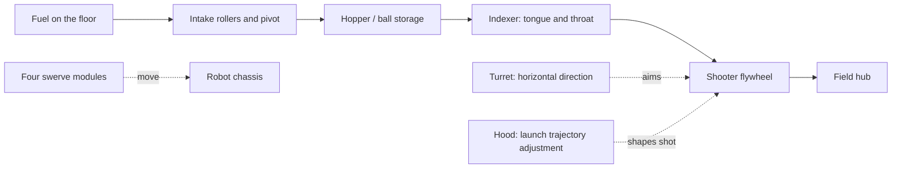
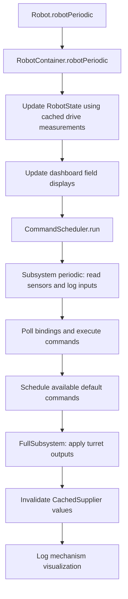
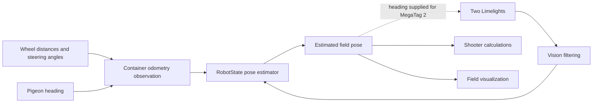

# Technical guide to the Sim-City 2026 robot code

This guide explains the software in this repository for someone with basic robotics knowledge. It starts with the physical robot, follows the software from startup to motor commands, and then explains the calculations and development tools.

The repository identifies itself as **FRC Team 3464, Sim-City, for the 2026 REBUILT season**. FRC means FIRST Robotics Competition. The robot collects balls called *fuel* and launches them toward a field target called the *hub*.

**Scope:** originally reviewed September 23, 2026; revalidated September 24 against `mentor-review` at [`477a8bf`](https://github.com/FRC-Team-3464/2026-code/tree/477a8bfc8be6f2bf33eba9ece365a21a50018a51), including the merged formatting/CI changes. Descriptions of active behavior follow executable code, including where it differs from comments. Hardware dimensions and tuning values below are configured values, not independently measured specifications. No robot deployment, physical testing, or simulation run was performed for this document.

Use this guide to learn what the code currently does. The [Architecture Review](ARCHITECTURE_REVIEW.md) compares that design with WPILib and AdvantageKit guidance; the [Mentor Recommendations](REUSE_RECOMMENDATIONS_2027.md) distinguish repairs, hardening, and team choices for future work.

## Contents

1. [What the robot does](#1-what-the-robot-does)
2. [Robotics concepts used in the code](#2-robotics-concepts-used-in-the-code)
3. [Repository and software stack](#3-repository-and-software-stack)
4. [Startup and the repeating control loop](#4-startup-and-the-repeating-control-loop)
5. [Commands, subsystems, and hardware interfaces](#5-commands-subsystems-and-hardware-interfaces)
6. [Hardware configuration](#6-hardware-configuration)
7. [Swerve drive](#7-swerve-drive)
8. [Position estimation and vision](#8-position-estimation-and-vision)
9. [Intake and indexer](#9-intake-and-indexer)
10. [Shooter and aiming calculations](#10-shooter-and-aiming-calculations)
11. [Driver and operator controls](#11-driver-and-operator-controls)
12. [Autonomous behavior and PathPlanner assets](#12-autonomous-behavior-and-pathplanner-assets)
13. [Simulation and replay](#13-simulation-and-replay)
14. [Telemetry, visualization, and utilities](#14-telemetry-visualization-and-utilities)
15. [Building and developing the project](#15-building-and-developing-the-project)
16. [Implementation issues to understand](#16-implementation-issues-to-understand)
17. [Suggested source-reading order](#17-suggested-source-reading-order)
18. [Glossary](#18-glossary)

## 1. What the robot does

The robot has four independently steerable wheel assemblies, an intake, a two-motor ball feeder, and a shooter with three independently controlled parts.



The hopper is part of this conceptual ball path; there is no separate active `Hopper` software subsystem.

| Component | Physical purpose | Active software |
| --- | --- | --- |
| Drivetrain | Translate and rotate the robot | `Drive`, four `Module` objects |
| Intake | Collect or eject fuel; extend/retract the mechanism | `Intake` |
| Indexer | Move fuel from storage into the shooter | `Indexer` |
| Turret | Turn the shooter horizontally | `Turret` |
| Hood | Adjust the shot through a movable guide | `Hood` |
| Flywheel | Accelerate fuel using a spinning wheel | `Flywheel` |
| Cameras | Estimate the robot's location using field markers | `Vision`, two Limelight interfaces |
| LEDs | Display operating-mode patterns | `Leds` |

The current operator workflow is to aim and spin the shooter with one control, then feed fuel with another. There is no active ball-counting or ball-presence sensor logic in the intake/indexer interfaces.

The current autonomous routine spins the flywheel, adjusts the hood, and begins feeding after a flywheel readiness check. It does **not** follow a driving path or automatically turn the turret. Numerous stored routes exist, but they are not selected by the current autonomous code.

Source: [RobotContainer.java](../src/main/java/frc/robot/RobotContainer.java), [Shooter.java](../src/main/java/frc/robot/subsystems/shooter/Shooter.java).

## 2. Robotics concepts used in the code

### Motors, motor controllers, and sensors

A motor supplies mechanical motion. A **motor controller** is the electronic device that applies power to the motor and receives software commands. A Talon FX or Spark MAX object in Java represents a motor-controller connection; it is not itself the motor's physical simulation.

An **encoder** measures rotation. The software converts motor or wheel rotations into useful values such as wheel travel or turret angle. A **gyro** measures orientation and rotation; this robot uses a Pigeon 2 for heading.

The robot's main computer, the **roboRIO**, runs this Java program. Motor controllers communicate over **CAN**, a shared device network. Cameras exchange data with the robot through **NetworkTables**, a networked key/value data system also used for dashboards.

### Open-loop and closed-loop control

Consider two motors already in this robot. Holding the operator's left bumper while the left trigger is released runs the intake rollers. A shooter command instead asks the flywheel to reach a particular rotational speed. Both use motors, but they answer different questions: **“How much output should I request?”** and **“How fast should the wheel actually turn?”**

**Open-loop control** answers the first question. `Intake.intake()` passes `IntakeConstants.kRollerMotorSpeed`, currently `0.8`, to `IntakeIOTalonFX.setWheelSpeed()`. That sends a `0.8` duty-cycle request to the Talon FX. The controller does not compare the roller's measured speed with a target speed. A battery voltage drop or fuel pressing against the roller can slow it even while the request remains `0.8`.

**Closed-loop control** answers the second question. Suppose a shooter command calls `Flywheel.setVelocity(2400)` to request 2,400 revolutions per minute (RPM). That method converts the request to 40 revolutions per second (RPS) for `FlywheelIOTalonFX`. The Talon FX uses motor-speed feedback to adjust its output toward the requested speed. Meanwhile, `Flywheel.periodic()` reads the measured speed and logs it. The requested value is a **setpoint**; the measured value tells us what the motor achieved. Feedback can correct for a changing load while sufficient power is available, but it cannot guarantee that the motor reaches its target.

```text
Intake:   button → request 0.8 output → roller turns; measured speed is not used to correct it
Flywheel: target speed → controller → motor → speed sensor → controller adjusts output
```

This project also uses closed-loop position control for module steering, turret, and hood, and closed-loop velocity control for drive wheels. “Closed-loop” describes the use of feedback; it does not mean every mechanism uses the same sensor, gains, or control code.

A simplified equation for a controller that uses PID and feedforward is:

```text
error = target - measurement
output = kP * error + kI * accumulated_error + kD * rate_of_error_change
         + feedforward
```

Here, `error` means **requested value minus measured value**. `kP` responds to the current difference, `kI` can respond to an error that persists, and `kD` responds to how the difference changes. **Feedforward** estimates output needed for the requested motion before feedback corrects the remaining error. `ShooterConstants.FlywheelConstants.kGains` supplies the real flywheel controller with `kP`, `kI`, `kD`, `kS`, `kV`, and `kA` values. Those constants configure this particular controller; the equation is a teaching model, not a claim that every motor uses all six terms. Incorrect gains or insufficient available output can still prevent the flywheel from reaching its setpoint.

The real Talon FX and Spark MAX implementations generally send targets and gains to the motor controllers. The simulation implementations instead use Java controllers and simulated motor models. The current flywheel simulator has a unit mismatch, described in [Section 13](#flywheel-simulation-mismatch), so its apparent response should not be used to judge real flywheel tuning.

### Coordinates and units

The robot coordinate convention is **+X forward, +Y left, +Z up**, with positive planar rotation counterclockwise when viewed from above. A field-relative command uses axes fixed to the field; a robot-relative command uses axes that turn with the robot. See the [WPILib coordinate-system explanation](https://docs.wpilib.org/en/stable/docs/software/basic-programming/coordinate-system.html).

For this robot's normal joystick drive, `DefaultControls` passes the driver's left-stick values to `DriveCommands.joystickDrive()`. On blue alliance, a forward stick request points toward field +X. If the raw gyro reports that the robot has turned +90° from field +X, the same field-forward request becomes robot-right (negative robot Y) before `Drive.runVelocity()` receives it. The transformation keeps the requested field direction fixed while the robot turns. Red-alliance driver perspective adds an additional transform; the example assumes blue alliance and a correctly referenced gyro.

| Type or unit | Meaning in this repository |
| --- | --- |
| `Translation2d` | A two-dimensional location or displacement, usually in meters |
| `Rotation2d` | An angle with conversions between radians, degrees, and rotations |
| `Pose2d` | Location and heading together: `(x, y, angle)` |
| `Transform2d` / `Transform3d` | A displacement and rotation relating two coordinate frames |
| `Twist2d` | A small movement used to advance a pose |
| `ChassisSpeeds` | Forward speed, sideways speed, and angular speed |
| RPM | Revolutions per minute |
| RPS | Revolutions per second |
| rad/s | Radians per second; one revolution equals `2π` radians |

Unit conversion is part of the control logic, not just formatting:

```text
RPS = RPM / 60
rad/s = RPM * 2π / 60
wheel travel in meters = wheel angle in radians * wheel radius in meters
```

Be especially careful with methods named `setOpenLoop`: drive-module implementations use volts in the current configuration, while most mechanism implementations use normalized output from `-1` to `+1`.

## 3. Repository and software stack

The scan found **75 Git-tracked Java files**, plus a generated `BuildConstants.java` in the working folder; **66 `.auto` files** and **92 `.path` files**; and no test sources under `src`.

```text
2026-code/
├── README.md                    Short project introduction
├── docs/
│   ├── TECHNICAL_GUIDE.md        This guide
│   ├── ARCHITECTURE_REVIEW.md    Design assessment and upstream references
│   └── REUSE_RECOMMENDATIONS_2027.md  Recommendations and acceptance plan
├── build.gradle                 Compile, format, simulate, and deploy setup
├── settings.gradle              Gradle repository configuration
├── gradlew / gradlew.bat         Gradle launchers
├── gradle/wrapper/               Pinned Gradle distribution
├── vendordeps/                   Vendor-library version manifests
├── .wpilib/                     Team number and project language/year
├── .github/workflows/build.yml   GitHub build workflow
├── src/main/java/frc/robot/
│   ├── Main.java                 Java entry point
│   ├── Robot.java                Lifecycle and logging
│   ├── RobotContainer.java       Hardware assembly and behavior wiring
│   ├── RobotState.java           Shared pose estimate and targeting state
│   ├── RobotVisualizer.java      Mechanism poses for visualization
│   ├── Constants.java            Modes, IDs, and robot-wide settings
│   ├── commands/                 Drive command factories
│   ├── control/                  Controller abstraction and bindings
│   ├── subsystems/               Mechanism behavior and hardware interfaces
│   └── util/                     Geometry, field data, and support classes
└── src/main/deploy/pathplanner/  Paths, autonomous compositions, and settings
```

`build/`, `bin/`, and `.gradle/` contain generated outputs or caches. `networktables.json` and `simgui*.json` are ignored local tool state, not the main robot configuration.

Versions below come from this checkout, not a claim about the latest available releases.

| Technology | Declared version | Role |
| --- | --- | --- |
| Java | 17 source/target | Implementation language |
| Gradle wrapper | 8.11 | Build-task runner |
| GradleRIO | 2026.2.1 | WPILib build and deployment integration |
| AdvantageKit | 26.0.1 | Structured telemetry and replay infrastructure |
| CTRE Phoenix 6 | 26.1.1 | Talon FX, CANcoder, Pigeon 2 interfaces |
| REVLib | 2026.0.3 | Spark MAX interfaces |
| PathPlannerLib | 2026.1.2 | Autonomous path tooling, currently disconnected |
| PhotonVision | v2026.2.2 | Alternative camera implementation, currently unused |
| Studica | 2026.0.0 | Alternative navX gyro implementation |
| JUnit Jupiter | 5.10.1 | Test framework dependency; no tests found |
| Spotless | 6.25.0 | Formatting integration |
| google-java-format | 1.21.0 | Pinned Java formatter used by Spotless |

The `WPILibNewCommands.json` manifest's `1.0.0` value identifies that vendor manifest; it should not be read as the project's WPILib release.

Sources: [build.gradle](../build.gradle), [Gradle wrapper properties](../gradle/wrapper/gradle-wrapper.properties), [vendor manifests](../vendordeps), [WPILib preferences](../.wpilib/wpilib_preferences.json).

## 4. Startup and the repeating control loop

### Startup

1. `Main.main()` calls `RobotBase.startRobot(Robot::new)`.
2. `Robot`, which extends AdvantageKit's `LoggedRobot`, records build and Git metadata.
3. It chooses telemetry receivers according to `Constants.kCurrentMode` and starts the logger.
4. `RobotContainer` constructs hardware or simulated interfaces and their subsystems.
5. The container installs default commands and controller bindings.
6. `Robot` resets its estimated rotation and pose to zero.

The runtime mode is `REAL` on a physical roboRIO. On a desktop it uses `kSimMode`, currently `SIM`.

### Every nominal 20 milliseconds

The main loop targets 50 iterations per second. Its order matters:



The scheduler runs registered subsystem `periodic()` methods, polls triggers, executes and finishes commands, then schedules available defaults. This is why most mechanism activity does not appear in `teleopPeriodic()`. See the [WPILib scheduler sequence](https://docs.wpilib.org/en/stable/docs/software/commandbased/command-scheduler.html).

Two project-specific details are easy to miss:

- `RobotContainer.robotPeriodic()` runs **before** `Drive.periodic()` refreshes inputs. For example, at the start of a loop it submits the module positions saved by the previous loop, but attaches the current time. Only afterward does `Drive.periodic()` read the newer positions. The nominal age difference is roughly one main-loop period.
- `Shooter.periodic()` manually calls `periodic()` on the hood, turret, and flywheel. Those children also inherit from registered subsystem classes, so the scheduler calls them too. In a nominal 20 ms robot cycle, their simulated models each receive two 20 ms updates: 40 ms of simulated motion for one robot cycle. This is why counting actual update calls matters when checking simulation results.

`FullSubsystem` adds an output stage after command execution. Only the turret currently extends it. The flywheel writes its velocity request to IO inside its setter. The hood's angle setter stores a target, and `Hood.periodic()` sends that target to IO; a target chosen during command execution therefore takes effect on the next periodic update. Hood open-loop requests call IO immediately. Keep these different timings in mind when reading a command trace.

### Operating modes

| Mode transition | Implemented behavior |
| --- | --- |
| Disabled | `disabledInit()` and `disabledPeriodic()` are empty; the scheduler still performs periodic work, and `Drive.periodic()` explicitly stops modules |
| Autonomous starts | Build and schedule the command from `getAutonomousCommand()` |
| Teleop starts | Cancel the remembered autonomous command |
| Test starts | Cancel all scheduled commands at that moment |
| Simulation callbacks | Present but empty; most simulation happens through IO classes |

Cancelling all commands in `testInit()` does not permanently prevent defaults or bindings from scheduling later. In the pinned WPILib `2026.2.1`, LiveWindow is disabled in test mode by default, and this project does not enable it; do not assume LiveWindow will disable the command scheduler. Also, default commands and bindings are not explicitly restricted to teleop here. The autonomous command does not claim the drivetrain, so the joystick-drive default can remain available during autonomous. See the [versioned robot lifecycle source](https://github.com/wpilibsuite/allwpilib/blob/v2026.2.1/wpilibj/src/main/java/edu/wpi/first/wpilibj/IterativeRobotBase.java).

Sources: [Main.java](../src/main/java/frc/robot/Main.java), [Robot.java](../src/main/java/frc/robot/Robot.java), [FullSubsystem.java](../src/main/java/frc/robot/util/FullSubsystem.java).

## 5. Commands, subsystems, and hardware interfaces

### Commands express actions

A **subsystem** owns a mechanism. A **command** represents an action using one or more subsystems. Commands declare subsystem **requirements**, allowing the scheduler to resolve competing actions. An interruptible command is cancelled when a newly scheduled command needs the same subsystem. A default command runs when its subsystem is otherwise available. These rules are described in the [WPILib scheduler documentation](https://docs.wpilib.org/en/stable/docs/software/commandbased/command-scheduler.html).

The project frequently uses these factories:

| Factory | Meaning | Project example |
| --- | --- | --- |
| `runOnce` | Perform one action, then finish | Request an X wheel arrangement |
| `run` | Repeat an action while scheduled | Joystick driving |
| `startEnd` | Act on start and on end | Start indexer motors, then stop them |
| `runEnd` | Repeat while active and clean up on end | Intake rollers |
| `sequence` | Run commands in order | Wait for flywheel, then index |
| `parallel` / `alongWith` | Run commands together | Track turret, hood, and flywheel |
| `waitUntil` | Finish when a condition is true | Flywheel readiness |
| `withTimeout` | Bound how long a command can run | Intake deployment registration for paths |

For example, `indexer.index()` **creates and returns** a command. It does not immediately start the motor. A binding, composition, or explicit scheduling call must run that command. This distinction also matters for `drive.zeroYaw()`.

The shooter is a coordinating subsystem with three child subsystems. Its active tracking composition separately requires turret, hood, and flywheel, allowing an independent indexer command to run alongside them.

Follow the operator's right bumper as an example. `DriverControls` schedules a command that tracks the turret, hood, and flywheel. Each tracking command declares the child subsystem it controls. If the operator also holds the right trigger, `indexer.index()` can run because it declares the separate `Indexer` requirement. Releasing the bumper ends tracking; releasing the trigger ends feeding. The hood D-pad commands are an exception to this ownership pattern: they request manual hood output without declaring a hood requirement, so the scheduler cannot keep the hood's default command from competing with them. A requirement is therefore a practical rule for **who gets to control a mechanism**, not just a label on a command.

### IO separates behavior from devices

Most mechanisms have this structure:

```text
Mechanism.java          Behavior, command factories, and logged inputs
MechanismIO.java        Interface defining measurements and output methods
MechanismIOVendor.java  Real hardware implementation
MechanismIOSim.java     Simulated or placeholder implementation
MechanismConstants.java Configuration values
```

For example, `Flywheel` knows it needs a velocity measurement and a way to set velocity. `FlywheelIOTalonFX` knows how to communicate with a Talon FX. `RobotContainer` chooses the implementation and passes it into the subsystem constructor. This is **dependency injection**: the behavior receives its hardware dependency instead of creating it internally.

On the real robot, `RobotContainer` constructs `FlywheelIOTalonFX`; in desktop `SIM` mode, it constructs `FlywheelIOSim`. `Flywheel.periodic()` uses the same `FlywheelIO` methods in both cases: read the current inputs, log them, and evaluate readiness. The implementation behind the interface decides where measurements come from and how an output request is applied. Swapping IO implementations does not make the simulation physically accurate; its modeled behavior still needs checking.

The usual input pattern is:

```java
io.updateInputs(inputs);
Logger.processInputs("Intake", inputs);
```

`@AutoLog` causes AdvantageKit's annotation processor to generate classes such as `IntakeIOInputsAutoLogged`. Input snapshots support logging and, when the application is correctly configured, replaying recorded measurements. See [AdvantageKit's input-recording documentation](https://docs.advantagekit.org/data-flow/recording-inputs/).

Default methods on IO interfaces do nothing. This is convenient for absent hardware and replay, but it also means an incomplete implementation can compile successfully without controlling or simulating anything.

Sources: [IntakeIO.java](../src/main/java/frc/robot/subsystems/intake/IntakeIO.java), [Flywheel.java](../src/main/java/frc/robot/subsystems/shooter/flywheel/Flywheel.java).

## 6. Hardware configuration

The active real-hardware constructors are in `RobotContainer`. IDs are in `Constants.DeviceIDs`, with drivetrain values supplied by `DriveConstants.TunerConstants`.

| Device | Interface / controller | Configured CAN ID |
| --- | --- | --- |
| Front-left drive / steer / absolute encoder | Talon FX / Talon FX / CANcoder | 1 / 2 / 19 |
| Front-right drive / steer / absolute encoder | Talon FX / Talon FX / CANcoder | 3 / 4 / 20 |
| Back-left drive / steer / absolute encoder | Talon FX / Talon FX / CANcoder | 5 / 6 / 21 |
| Back-right drive / steer / absolute encoder | Talon FX / Talon FX / CANcoder | 7 / 8 / 22 |
| Gyro | Pigeon 2 | 23 |
| Shooter flywheel | Talon FX | 12 |
| Hood | Spark MAX | 13 |
| Turret azimuth | Spark MAX | 14 |
| Indexer tongue / throat | Talon FX / Talon FX | 15 / 16 |
| Intake roller | Talon FX | 17 |
| Intake left / right pivot | Talon FX / Talon FX | 18 / 19 |
| Legacy guts motor | Unused Talon FX implementation | -1 placeholder |

Numeric ID 19 occurs for both a CANcoder and a Talon FX. Record the device type and bus along with the number when checking the hardware; repeated numbers across device types alone do not establish a collision.

The swerve CAN bus name is the empty string in `TunerConstants`; mechanism constructors use their default bus. Do not infer a dedicated CANivore installation from the presence of CAN-FD support in the source.

Other connections are:

- Driver Xbox controller: USB/Driver Station port `0`.
- Operator Xbox controller: port `1`.
- Limelight NetworkTables names: `limelight-front` and `limelight-one`.
- Addressable LED strip: PWM port `0`, configured length `30`.

The constants also define controller port numbers, but `RobotContainer` currently supplies literal `0` and `1` to the controller constructors.

### Mechanical values used by software

| Value | Configuration |
| --- | --- |
| Wheel radius | 2 inches = 0.0508 m |
| Module X offsets | ±9.375 inches = ±0.238125 m |
| Module Y offsets | ±12.875 inches = ±0.327025 m |
| Maximum configured wheel speed | 5.85 m/s |
| Drive reduction | 5.2734375 motor turns per wheel turn |
| Steering reduction | Approximately 26.0909 motor turns per steering turn |
| Turret reduction | 10:1 |
| Hood reduction | 16:1 |
| Turret location relative to robot origin | 7.5 inches forward, 4 inches right, 14.5 inches up |
| Turret software bounds | -90° to +210° |
| Hood software bounds | -3.9 to 0 radians |

The hood bounds and table entries are the mechanism coordinates used by this program. Do not interpret them as independently verified fuel launch angles. Startup sets the hood and turret relative encoders to zero; there is no implemented absolute-sensor or limit-switch homing routine for them.

Sources: [Constants.java](../src/main/java/frc/robot/Constants.java), [DriveConstants.java](../src/main/java/frc/robot/subsystems/drive/DriveConstants.java), [ShooterConstants.java](../src/main/java/frc/robot/subsystems/shooter/ShooterConstants.java).

## 7. Swerve drive

### How swerve movement works

Each wheel assembly has one motor to roll the wheel and another to turn its direction. The robot can drive forward, move sideways, rotate, or combine translation and rotation.

For a simple example, `Drive.runVelocity(new ChassisSpeeds(1.0, 0.0, 0.0))` requests motion forward at 1 m/s in robot coordinates with no rotation. Before module optimization, the ideal target for all four wheels is forward at 1 m/s. A request of `(0.0, 0.0, 1.0)` instead asks the robot to rotate; each wheel then needs a different direction based on its position around the robot center. `Drive` asks WPILib's `SwerveDriveKinematics` to calculate those targets and may reverse a wheel's rolling direction to reduce the amount its steering motor must turn.

For a module located at `(x_i, y_i)` relative to the robot center, the basic velocity relationship is:

```text
module_vx = chassis_vx - angular_speed * y_i
module_vy = chassis_vy + angular_speed * x_i
module_speed = sqrt(module_vx² + module_vy²)
module_angle = atan2(module_vy, module_vx)
```

The code delegates this conversion to `SwerveDriveKinematics`. The order is consistently **front left, front right, back left, back right**. Mixing that order would associate wheel measurements with the wrong physical locations.

### From joystick to wheel motors

The active path is:

```text
DefaultControls
  → DriveCommands.joystickDrive(...)
  → deadband and squared joystick response
  → field-to-robot coordinate conversion
  → Drive.runVelocity(ChassisSpeeds)
  → four module speed/angle targets
  → Module.runSetpoint(...)
  → ModuleIOTalonFX
  → drive velocity and steering position requests
```

`joystickDrive()` applies a `0.1` deadband, so small stick movements are ignored. It squares the translation magnitude and rotation magnitude for gentler response near the center. Translation is scaled by 5.85 m/s; angular speed is scaled by maximum linear speed divided by the drive-base radius.

The field-relative conversion uses the **raw drivetrain gyro rotation**, adjusted for alliance, rather than `RobotState`'s vision-corrected heading.

`Drive.runVelocity()` discretizes the requested motion for a 20 ms interval and converts it to four module states. It then **desaturates** wheel speeds: if any exceeds the configured maximum, the set is scaled to fit.

Each `Module.runSetpoint()` then:

1. Optimizes steering: it can reverse the wheel speed and turn the wheel less.
2. Uses cosine scaling to reduce drive speed while the wheel is misaligned.
3. Converts linear wheel speed to angular speed using the wheel radius.
4. Sends drive-velocity and turn-position targets to the IO implementation.

The hardware implementation converts radians per second to rotations per second for Phoenix, configures encoder offsets, and uses the CANcoder as steering feedback. Drive feedback uses a sensor-to-mechanism ratio so measured rotations represent the wheel mechanism.

### Other driving commands

`stopWithX()` arranges wheels diagonally to resist pushing. The B-button binding invokes this once. A subsequent nonzero drive request returns the modules to normal driving angles; it is not a latched driver mode.

`crabWalk()` drives at 1 m/s in one of eight **robot-relative** directions. Diagonal commands are normalized so they are not faster. This differs from the normal field-relative joystick drive.

Angle-holding drive, turn-to-point, feedforward characterization, wheel-radius characterization, and SysId commands are present but are not connected to the active controls. Characterization means collecting measurements to identify motor or geometry parameters.

### Fast sensor sampling versus active odometry

`PhoenixOdometryThread` collects timestamped sensor samples into bounded queues. The configured rate is 250 Hz on CAN FD or 100 Hz otherwise, with locks protecting shared data.

However, the calls that would feed these high-rate samples into `RobotState` are commented out in `Drive.periodic()`. Current pose updates come from the container's 50 Hz snapshot. The gyro's queued-array extraction and clearing are also commented out.

The disconnected-gyro alert says that kinematics provides a fallback, but the wheel-based heading fallback is commented out. In the current simulator, the empty gyro interface therefore leaves raw heading at zero even when wheel motion requests rotation.

Sources: [DriveCommands.java](../src/main/java/frc/robot/commands/DriveCommands.java), [Drive.java](../src/main/java/frc/robot/subsystems/drive/Drive.java), [Module.java](../src/main/java/frc/robot/subsystems/drive/Module.java), [ModuleIOTalonFX.java](../src/main/java/frc/robot/subsystems/drive/ModuleIOTalonFX.java), [PhoenixOdometryThread.java](../src/main/java/frc/robot/subsystems/drive/PhoenixOdometryThread.java).

## 8. Position estimation and vision

### Why the robot needs an estimate

**Odometry** estimates movement from wheel travel and heading. It is useful over short intervals, but wheel slip and calibration errors accumulate. Cameras can recognize **AprilTags**, known visual markers on the field, to provide location measurements that help correct that estimate.

In this program, `Drive` supplies four wheel-position readings and a gyro angle; `RobotContainer.robotPeriodic()` submits them to `RobotState`. Imagine the wheels report forward travel while the gyro reports a turn: the pose estimator combines both to update where the robot is facing and where it has moved. A Limelight can separately report a field pose from visible AprilTags. `RobotState` combines the camera observation with wheel/gyro history; the camera is another measurement, not a replacement for the wheel sensors.

`RobotState` owns a single `SwerveDrivePoseEstimator` and makes its result available throughout the program.



### Limelight data flow

`CameraIOLimelight` reads both `botpose_wpiblue` and `botpose_orb_wpiblue`. These represent MegaTag 1 and MegaTag 2 observations in the blue-origin field frame. It publishes estimated robot heading on `robot_orientation_set` for MegaTag 2.

The interface computes observation time from the NetworkTables publication timestamp minus reported camera latency. This matters because an image describes where the robot was when the measurement was captured, not necessarily where it is when the program reads it.

Connection status is inferred from whether the latency topic has changed within 250 ms. The active camera positions must be configured in the Limelight web interface; the Java `kRobotToCamera0/1` transforms are for the alternative PhotonVision implementation.

### Filtering and measurement confidence

`Vision.periodic()` rejects a pose if it has no tags, if a single-tag ambiguity exceeds `0.3`, if its absolute Z exceeds `0.75 m`, or if X/Y lie outside the field boundaries.

For accepted observations, it calculates uncertainty approximately as:

```text
factor = average_tag_distance² / number_of_tags
linear_standard_deviation = 0.02 m * factor
angular_standard_deviation = 0.06 rad * factor
```

It also applies camera factors and MegaTag 2 factors. The MegaTag 2 angular factor is infinity, expressing the intent to avoid treating its heading as an independent rotation measurement.

For example, with the same camera and one visible tag, doubling the reported average tag distance multiplies the calculated standard deviation by four. The intended result is to trust a distant observation less. A measurement with more visible tags receives a smaller calculated standard deviation under this formula. These are properties of the calculated values, not proof of real camera accuracy.

**Current implementation gap:** the `VisionMeasurement` record carries these standard deviations, but `RobotState.addVisionMeasurement()` calls the estimator overload with only pose and timestamp. The calculated per-observation uncertainty is discarded. Consequently, the intended confidence weighting, including suppressing MegaTag 2 heading influence, is not applied through this path.

### Alliance and target selection

`FieldConstants` describes the field from the blue alliance perspective and currently selects the AndyMark field layout. `VisionConstants` separately loads that same layout.

`AllianceFlipUtil` maps coordinates for red alliance using:

```text
x_red = field_length - x_blue
y_red = field_width - y_blue
heading_red = heading_blue + 180 degrees
```

If alliance information is absent, the utility does not flip. `RobotState.getShooterTarget()` always returns the alliance-adjusted hub center in two dimensions. Passing targets and zone-dependent selection are commented out, and `HubTracker` is not connected to shooting.

### Heading reset detail

The Pigeon constructor calls `pigeon.setYaw(0)`. Later, `GyroIOPigeon2.setYaw(angle)` adds 180° to its argument before writing it. The driver X binding calls both estimator rotation reset and `drive.zeroYaw()`; this is not a simple universal “everything becomes zero” operation. The drivetrain temporarily stores the requested heading, then reads the hardware-adjusted heading on its next refresh.

Also, `Drive` calls `zeroYaw()` in its constructor but does not schedule the returned command. The real startup zero comes from the Pigeon constructor, not from executing that returned command.

Sources: [RobotState.java](../src/main/java/frc/robot/RobotState.java), [Vision.java](../src/main/java/frc/robot/subsystems/vision/Vision.java), [CameraIOLimelight.java](../src/main/java/frc/robot/subsystems/vision/CameraIOLimelight.java), [VisionConstants.java](../src/main/java/frc/robot/subsystems/vision/VisionConstants.java), [GyroIOPigeon2.java](../src/main/java/frc/robot/subsystems/drive/GyroIOPigeon2.java).

## 9. Intake and indexer

### Intake

The intake has a roller motor and two pivot motors. Its active commands are open-loop:

| Action | Requested output |
| --- | --- |
| Intake fuel | Roller `+0.8` |
| Eject fuel | Roller `-0.8` |
| Deploy | Left pivot `+0.1`; right receives left request multiplied by `-0.95` |
| Retract | Left pivot `-0.1`; right receives left request multiplied by `-0.95` |

The right motor also has its own inversion configuration. The values above describe software requests, not independently verified physical rotation directions.

The code explains the different pivot outputs as compensation for different gear ratios. It creates a follower request but does not apply it; active open-loop control commands both motors directly.

Position-based deployment/retraction methods exist, but they are not bound to controls. Their configured position-control gains are all zero, and extension position `100.0` rotations is marked for tuning. These methods should be understood as unfinished functionality.

All intake commands require the same `Intake` subsystem, including roller-only and pivot-only commands. Consequently, deploying while intaking interrupts the roller command. The software does not allow those actions to own independent parts of the mechanism concurrently.

`intakeSignificantlyFaster()` currently requests the same roller output as `intake()` despite its name.

### Indexer

`Indexer.index()` starts the throat at `-0.4` and the tongue at `+0.4`, then stops both when the command ends. `indexReverse()` reverses those signs. The separate tongue-speed constant `0.5` is not used by these commands.

The active operator binding feeds whenever the right trigger is held. It does not check shooter readiness, target validity, ball presence, or hub activity. The autonomous routine has a one-time flywheel readiness gate, discussed below.

### Legacy guts subsystem

`subsystems/guts/` contains another motor subsystem with real and simulation implementations. `RobotContainer` never constructs it, and its hardware ID is the unused placeholder `-1`. It is not an additional active stage in the current feeding system.

Sources: [Intake.java](../src/main/java/frc/robot/subsystems/intake/Intake.java), [IntakeIOTalonFX.java](../src/main/java/frc/robot/subsystems/intake/IntakeIOTalonFX.java), [IntakeConstants.java](../src/main/java/frc/robot/subsystems/intake/IntakeConstants.java), [Indexer.java](../src/main/java/frc/robot/subsystems/indexer/Indexer.java).

## 10. Shooter and aiming calculations

### Three controlled mechanisms

The turret controls horizontal direction. The hood controls a mechanism angle that changes the shot. The flywheel controls launch energy through rotational speed.

`Shooter.readyToShoot()` combines all three `atGoal()` values. However, the active manual feed control does not use it, and autonomous checks only `flywheelAtGoal()`.

The operator controls make that distinction concrete: holding the right bumper asks the shooter to aim and spin, while holding the right trigger runs the indexer that feeds fuel. The trigger does not consult `Shooter.readyToShoot()`. The robot may therefore feed while the flywheel is still speeding up or while the turret or hood is still moving. A readiness flag reports what its code checks; it is not a physical guarantee that a shot will score.

### Distance lookup table

`TrajectoryCalculator` uses a calibrated lookup-table approach rather than solving a complete ballistic model. Its entries are:

| Distance, m | Table wheel RPM | Table hood value, rad | Time of flight, s |
| --- | --- | --- | --- |
| 2.36 | 2000 | 0 | 0.45 |
| 2.60 | 2100 | -0.50 | 0.52 |
| 3.00 | 2150 | -1.00 | 0.60 |
| 3.50 | 2350 | -1.50 | 0.68 |
| 4.00 | 2500 | -1.75 | 0.76 |
| 4.50 | 3000 | -2.00 | 0.76 |

The interpolation routine calculates values between table entries. For example, at 3.25 m, halfway between 3.0 and 3.5 m, the table gives 2250 RPM, -1.25 rad, and 0.64 s.

The advanced calculator clamps queried distance to 1.5–5.0 m, but the table itself only has samples from 2.36–4.5 m. That wider clamp is not evidence of calibration across the whole range. Its `IsInRange` result is logged; it does not inhibit feeding.

### The active aiming command uses different calculation paths

The long method name `trackAndShootAtTargetFullRealCommandLatestGoodUseThisOne()` combines three commands. Despite the word “Shoot,” it does not run the indexer.

| Mechanism | Active calculation |
| --- | --- |
| Turret | `Turret.trackTarget()`: geometric aiming from turret location to target |
| Hood | `Hood.trackTarget()`: `calculateHoodAngle()`, which uses half the table hood value at robot-center distance |
| Flywheel | `Shooter.trackTargetFlywheel()`: full `TrajectoryCalculator.calculate()`, using the returned table RPM |

Thus, if the hood's robot-center distance is 3.25 m, its active target is **-0.625 rad**, not the raw table's -1.25 rad. The flywheel's distance is calculated from the offset turret location, so its interpolation need not use exactly the same distance.

There is also a `calculateRPM()` helper that returns 60% of table RPM, but the active flywheel tracking command does not call it. This is a useful example of why following the call chain matters more than reading a method name.

### Turret geometry

The turret is offset from the robot center. `Turret.trackTarget()` computes:

```text
turret_field_position = robot_field_position + rotated_turret_offset
target_vector_field = target_position - turret_field_position
target_vector_robot = rotate(target_vector_field, -robot_heading)
geometric_angle = atan2(target_vector_robot.y, target_vector_robot.x)
commanded_angle = -geometric_angle
```

The final sign reversal is part of this implementation's motor/frame convention. Do not remove it solely because the geometric equation looks sufficient.

The Spark MAX implementation clamps closed-loop targets to the configured bounds. Turret open-loop control checks whether the measured position is outside those bounds; if so, it blocks both directions. This is not a direction-aware recovery limit, and hardware soft limits are explicitly disabled in the Spark configuration.

### Motion compensation infrastructure

The full `TrajectoryCalculator.calculate()` method attempts to account for robot movement:

1. Read pose, robot-relative velocity, and field-relative velocity.
2. Advance pose by a configured 0.05 s latency using `Pose2d.exp()`.
3. Transform the robot pose to the turret location.
4. Add the turret's tangential velocity caused by chassis rotation: `(-ω*y_offset, ω*x_offset)`.
5. Repeat a time-of-flight lookahead calculation ten times.
6. Return RPM, hood angle, and robot-relative turret angle for the resulting distance and direction.

Conceptually, moving sideways at 1 m/s during a 0.6 s flight introduces about 0.6 m of sideways motion into the prediction. The iteration reconciles changing shot distance with changing estimated flight time.

**Current limitation:** no active caller updates `RobotState.setRobotVelocity()`. Its velocity remains the initialized zero value, so velocity-based compensation contributes no movement prediction in this checkout. In addition, the active turret and hood commands bypass the compensated angle outputs. The presence of this calculator therefore does not establish functional shooting while moving.

### Flywheel control and readiness

The flywheel command accepts RPM, divides by 60, and sends RPS to Phoenix's `VelocityVoltage` request. Measured velocity is stored in radians per second.

Readiness compares measured rad/s with the goal converted to rad/s, using tolerance `25.0`. That means **25 rad/s**, approximately **239 RPM**, rather than 25 RPM. A rising-edge debouncer requires the condition to remain true for 0.2 s before reporting readiness.

Turret tolerance is 0.5° and hood tolerance is 1°. Their falling-edge debouncers work differently: becoming true is immediate, while becoming false is delayed. They do not require a sustained initial settling interval. Their readiness fields are updated when target setters run.

When active tracking ends, the flywheel receives zero open-loop output. The hood's default command returns it toward zero, and the turret's default requests zero open-loop output. `setOpenLoop(0)` does not clear the stored flywheel goal RPM, so readiness telemetry can still refer to the previous target afterward.

Sources: [Shooter.java](../src/main/java/frc/robot/subsystems/shooter/Shooter.java), [TrajectoryCalculator.java](../src/main/java/frc/robot/subsystems/shooter/TrajectoryCalculator.java), [Turret.java](../src/main/java/frc/robot/subsystems/shooter/turret/Turret.java), [Hood.java](../src/main/java/frc/robot/subsystems/shooter/hood/Hood.java), [Flywheel.java](../src/main/java/frc/robot/subsystems/shooter/flywheel/Flywheel.java).

## 11. Driver and operator controls

Both active controllers are Xbox controllers. `DriverController` also supplies PS4/PS5 adapters using paired names such as `aCross()` and `xSquare()`. Those adapters are alternatives, not simultaneously active controller mappings.

### Driver: port 0

| Input | Active behavior |
| --- | --- |
| Left stick Y / X | Field-relative forward/backward and sideways movement; axes are negated |
| Right stick X | Rotation; axis is negated |
| X | Reset estimated rotation and schedule gyro-zero request; see the 180° behavior above |
| B | Request X wheel arrangement once |
| D-pad, including diagonals | Robot-relative crab walking at 1 m/s while held |

### Operator: port 1

| Input | Active behavior |
| --- | --- |
| Left bumper, while left trigger is not active | Run intake rollers inward |
| Right bumper | Track turret and hood and spin flywheel while held |
| Right trigger | Feed indexer while held, independently of shooter readiness |
| A | Run intake rollers outward |
| X | Deploy intake pivot open-loop |
| Y | Retract intake pivot open-loop |
| D-pad left / right | Turret open-loop output `-0.05` / `+0.05` |
| D-pad up / down | Request hood open-loop output `+0.05` / `-0.05` |
| B | Reset turret relative encoder to zero; this does not move it to a known reference |

The hood D-pad bindings create `StartEndCommand`s **without a hood subsystem requirement**. They can compete with the hood's default or tracking command, which can restore closed-loop mode. Treat the mapping as the requested action, not as a guarantee of reliable manual hood movement.

The single-controller mapping is defined in a private method but never called. The commented driver left-bumper auto-aim binding is also inactive. `ZoneControls.configure()` is empty and is not installed by the container.

Sources: [DefaultControls.java](../src/main/java/frc/robot/control/DefaultControls.java), [DriverControls.java](../src/main/java/frc/robot/control/DriverControls.java), [DriverController.java](../src/main/java/frc/robot/control/DriverController.java).

## 12. Autonomous behavior and PathPlanner assets

### What autonomous currently runs

`RobotContainer.getAutonomousCommand()` returns this composition:

```text
Parallel group
├── Track flywheel target continuously
├── Track hood target continuously
└── Sequence
    ├── Wait until flywheelAtGoal() is true
    └── Run indexer continuously
```

There is no explicit drive trajectory, turret tracking command, intake command, duration limit, or ball-count termination. The group normally continues until interrupted, including cancellation on entry to teleop.

The readiness wait is a **one-time gate**. Once indexing begins, a subsequent RPM drop does not return the sequence to its waiting step. The condition is the flywheel's cached readiness field, so it should not be interpreted as a fresh combined turret/hood/flywheel alignment check.

For example, if the flywheel becomes ready and fuel starts feeding, a later fuel impact might slow the wheel. The running indexer command continues because the earlier `waitUntil` step has already finished. This follows directly from the command sequence; it does not depend on PathPlanner files, which are not connected to the active autonomous command.

### What the stored files represent

PathPlanner `.path` files contain geometry and motion constraints. `.auto` files compose paths, waits, and named robot actions. `settings.json` contains the robot model and editor defaults; `navgrid.json` contains a pathfinding grid.

For example, [URI Center.auto](../src/main/deploy/pathplanner/autos/URI%20Center.auto) describes following `C to C Tower`, then running an eight-second shooting phase, starting indexing after one second. This is a stored plan, not the command returned by the current robot program.

The reason those assets do not run is visible in `RobotContainer`:

- The call to `configurePathPlanner()` is commented out.
- The `AutoBuilder.configure(...)` body is commented out.
- Building and publishing the auto chooser is commented out.
- `getAutonomousCommand()` returns a manually built command instead of chooser output.
- `LocalADStarAK` exists but is not installed as a pathfinder.

The otherwise-unused configuration method registers `Shoot`, `Index`, `Intake`, `DeployIntake`, and `RetractIntake`. A scan of the assets also found lowercase `shoot`, `intake`, and `climb` references. These do not have matching registrations in that method. There is no implemented climber subsystem. Simply uncommenting the configuration would not fully integrate all stored autos.

All path names referenced by the scanned assets have corresponding `.path` files. That file-reference check does not validate the routes' physical feasibility or execution behavior.

There are also inconsistent robot-model values: `DriveConstants` specifies mass `72.088 kg`, whereas PathPlanner settings specify `52.163 kg`. Those configurations must be reconciled before treating them as an authoritative model for path following.

Sources: [RobotContainer.java](../src/main/java/frc/robot/RobotContainer.java), [PathPlanner settings](../src/main/deploy/pathplanner/settings.json), [autonomous files](../src/main/deploy/pathplanner/autos), [path files](../src/main/deploy/pathplanner/paths).

## 13. Simulation and replay

### Actual coverage

| Component | Desktop implementation | Practical limitation |
| --- | --- | --- |
| Swerve modules | Drive and turn motor models with feedback control | Individual modules are modeled; heading integration is incomplete |
| Gyro | Empty `GyroIO` | No simulated yaw update |
| Intake | `IntakeIOSim` | Entire implementation body is commented out |
| Indexer | `IndexerIOSim` | Methods delegate to no-op defaults |
| Turret | `DCMotorSim` with PID | Double periodic update and behavior differs from real limits |
| Hood | `SingleJointedArmSim` with gravity and PID | Double periodic update |
| Flywheel | `DCMotorSim` with PID | Unit and output-mode issues described below |
| Vision | No instance constructed in `SIM` | PhotonVision simulation class exists but is unused |
| LEDs | No instance constructed in `SIM` | No active LED simulation wiring |

There is no implemented end-to-end fuel trajectory, ball transport, scoring, or contact/obstacle simulation. Desktop simulation can expose control flow and some mechanism behavior, but it cannot currently demonstrate an accurate full match.

For example, in `SIM` the operator's right trigger can schedule `indexer.index()`, but `IndexerIOSim` does not model fuel moving through the robot. The flywheel and hood have simulated motors, subject to the timing and unit problems described here. A simulated button press can help explain the command path; it cannot by itself show that fuel reached the hub.

### Flywheel simulation mismatch

`Flywheel.setVelocity()` passes RPS to IO. `FlywheelIOSim.setVelocity()` uses that number directly as a PID setpoint, but compares it with `sim.getAngularVelocityRPM()`. A 2400 RPM request becomes `40`, which the simulator treats as a 40 RPM target rather than 40 RPS.

The simulator also recalculates voltage from PID unconditionally in `updateInputs()`, overwriting the voltage set by open-loop or stop methods. Its configured reduction is `300`, while the real flywheel implementation does not apply that constant as a sensor-to-mechanism conversion. These differences prevent assuming equivalent simulated and real flywheel behavior.

### Replay is only partially connected

`Robot` contains the expected replay logger setup: select a log, use `WPILOGReader`, disable real-time pacing, and write a new log with `_sim` appended.

However, `RobotContainer` has no `REPLAY` construction branch. Choosing that mode leaves its subsystem fields uninitialized, and binding configuration accesses them. Replay therefore needs IO/subsystem construction completed before it can work; changing `kSimMode` alone is insufficient.

### Persistent logs are currently disabled on the real robot

The real-mode `WPILOGWriter` line is commented out. Both `REAL` and `SIM` add an `NT4Publisher` for live telemetry. Do not assume this application currently produces a USB `.wpilog` file for every run. External tooling might record network data separately, but that is outside the configuration reviewed here.

Sources: [Constants.java](../src/main/java/frc/robot/Constants.java), [Robot.java](../src/main/java/frc/robot/Robot.java), [FlywheelIOSim.java](../src/main/java/frc/robot/subsystems/shooter/flywheel/FlywheelIOSim.java), [ModuleIOSim.java](../src/main/java/frc/robot/subsystems/drive/ModuleIOSim.java).

## 14. Telemetry, visualization, and utilities

### Useful telemetry

Telemetry lets you compare what the robot was asked to do with what sensors report. For example, a large flywheel target/measurement difference could reflect acceleration, loading, an incorrect conversion, or a controller issue; the logs help distinguish those possibilities.

| Key or prefix | What to inspect |
| --- | --- |
| `Drive/Gyro` | Heading and connection status |
| `Drive/Module0` through `Drive/Module3` | Wheel/steering positions, velocities, electrical measurements, and connection flags |
| `SwerveStates/Setpoints` / `SetpointsOptimized` / `Measured` | Requested versus measured wheel behavior |
| `SwerveChassisSpeeds/Setpoints` / `Measured` | Requested versus reconstructed chassis motion |
| `RobotState/EstimatedPose` | Pose used for aiming and field display |
| `Vision/Camera0`, `Vision/Camera1` | Inputs and accepted/rejected camera poses |
| `LaunchCalculator/Distance` / `DistanceClamped` | Shot distance before and after clamping |
| `LaunchCalculator/LookaheadRobotPose` | Position prediction used by the full calculator |
| `Shooter/Flywheel/AtGoal` | Debounced speed readiness |
| `Turret/TargetAngleDegrees` / `TargetOffsetDegrees` | Requested turret angle and angle error |
| `Hood target angle` / `Hood target difference` | Active hood target and difference from measurement |
| `Intake` / `Indexer` | Mechanism electrical and velocity measurements |
| `Mechanism3d/Robot/Components` | Turret and hood transforms for visualization |

SmartDashboard also receives `FieldInstance`, `TargetField`, `Flywheel Velo`, and `Flywheel Setpoint`. `RobotVisualizer` produces component poses that can be associated with models in AdvantageScope. It does not control mechanisms or simulate fuel.

### LEDs

The LED implementation checks autonomous mode first and displays a rainbow, then disabled mode and displays green, otherwise moving red/white/blue stripes. Thus, the first branch wins if the Driver Station reports autonomous while disabled. These patterns do not report shooter readiness or ball state.

### Support classes worth recognizing

| Utility | Purpose and current status |
| --- | --- |
| `AllianceFlipUtil` | Active alliance-aware coordinate conversion |
| `FieldConstants` | Field geometry, tags, hubs, bumps, trenches, tower, depot, and outpost |
| `GeomUtil` | Conversions and operations for poses, transforms, and twists |
| `PhoenixUtil` | Retry CTRE operations when a status is unsuccessful |
| `SparkUtil` | Retry REV configuration and conditionally accept valid readings |
| `Direction` | Eight-direction representation used for D-pad driving |
| `FullSubsystem` | Post-scheduler output stage used by the turret |
| `CachedSupplier` | Cache a calculation until invalidation; global invalidation is called, but no active instances were found |
| `LoggedTunableNumber` | Dashboard-backed tuning values; no active instances were found |
| `LoggedDashboardChooser` | Replay-aware chooser helper; current container does not use it |
| `LocalADStarAK` | Logging wrapper for local pathfinding; not installed |
| `HubTracker` | Match-phase/hub-activity helper; not used to gate shooting |
| `Zone` | Geometric region triggers and combinations; no active zone-control wiring |
| `LimelightHelpers` | General Limelight API helper; active camera IO directly uses NetworkTables |

`GyroIONavX`, `ModuleIOTalonFXS`, and the PhotonVision camera implementations are alternative device adapters. Their presence does not mean the robot constructs those devices.

Sources: [RobotVisualizer.java](../src/main/java/frc/robot/RobotVisualizer.java), [Leds.java](../src/main/java/frc/robot/subsystems/leds/Leds.java), [utilities directory](../src/main/java/frc/robot/util).

## 15. Building and developing the project

### Toolchain and commands

The project targets Java 17 and the 2026 WPILib toolchain. Use the repository's Gradle wrapper so commands use its pinned Gradle version. Dependencies may need to be downloaded on the first build.

From the repository root on macOS/Linux, the relevant commands are:

```bash
./gradlew build
./gradlew test
./gradlew spotlessCheck
./gradlew spotlessApply
./gradlew simulateJava
```

On Windows, use `gradlew.bat` in place of `./gradlew`.

`build` compiles and packages the program and runs configured checks; `test` invokes the configured JUnit platform, but this checkout contains no test sources. `spotlessCheck` checks formatting and `spotlessApply` changes formatting. `simulateJava` launches the desktop program with the configured simulation support.

The simulation GUI is **disabled by default** in `build.gradle`, while Driver Station simulation support is added. If a visual simulator interface is desired, enable the GUI extension through the WPILib simulation launch options or adjust that build setting. A running desktop process by itself does not prove all mechanisms are simulated correctly.

These command descriptions come from the repository configuration. Documentation validation is separate from the simulator and hardware acceptance procedures in the recommendations; it does not establish working robot behavior.

### Build side effects

At the reviewed revision, `compileJava` no longer depends on `spotlessApply`. Formatting is an explicit developer action. `spotlessCheck` reports differences without repairing them, and `build` includes Spotless checks through Gradle's verification lifecycle. Generated build outputs are still expected.

The formatter's scope is explicit:

| Format | Current targets |
| --- | --- |
| Java | `src/**/*.java`, excluding generated `BuildConstants.java` |
| Gradle | `*.gradle`, `gradle/**/*.gradle` |
| JSON | `src/**/*.json`, `vendordeps/**/*.json` |
| Markdown and whitespace | `*.md`, `docs/**/*.md`, `.gitignore` |

These targets keep root simulator state and build output outside formatting. Recursive targets with exclusions are also a valid strategy, used in the matching AdvantageKit template. The narrower selection is a team workflow choice. Markdown checks here normalize whitespace and final newlines; they do not verify technical claims or links.

Spotless does not enforce Java naming conventions. Checkstyle is proposed in the recommendations but is not installed, so `checkstyleMain` is not currently an available task. The google-java-format `1.21.0` pin records the team's chosen formatter; Java 17 alone does not require downgrading from `1.22.0`, whose [build configuration includes a Java 17 profile](https://github.com/google/google-java-format/blob/v1.22.0/core/pom.xml).

The build also generates `BuildConstants.java` with Git revision, branch, dirty status, and build date. AdvantageKit records those values so telemetry can be associated with a code revision. Auto-logged input classes are generated by annotation processing; missing generated classes in an editor can indicate that the Gradle project has not been built or imported correctly.

### Deployment

The configured deployment command is:

```bash
./gradlew deploy
```

It targets team **3464**, packages application classes and dependencies into a runnable JAR, and copies `src/main/deploy` to `/home/lvuser/deploy` on the roboRIO. `deleteOldFiles = false` means removed local deployment files are not automatically deleted from that robot directory.

There is a notable Git side effect: the `eventDeploy` task checks whether the requested task names include “deploy.” On branches starting with `event`, it runs `git add -A` and creates a timestamped commit. This stages all working changes. On other branches, that automatic commit is skipped.

That task follows the [AdvantageKit `v26.0.1` build template](https://github.com/Mechanical-Advantage/AdvantageKit/blob/v26.0.1/template_projects/template/build.gradle), which also includes compile-time formatting and recursive formatting targets. Event commits can help preserve the code used at an event; the team should decide deliberately whether staging every working change fits its deployment workflow.

### Continuous integration

The GitHub workflow runs on pushes and pull requests in `wpilib/roborio-cross-ubuntu:2024-22.04`. It installs Temurin Java 17, sets up Gradle caching, runs `./gradlew spotlessCheck`, and then runs `./gradlew build`. A failed formatting step stops the job before the build. There is no `spotlessApply` step. Workflow configuration was reviewed; a successful GitHub-hosted run was not verified for this document.

Check the container against the supported toolchain, rather than judging compatibility by its year alone. WPILib's current CI example uses the 2025 container for 2026 and explains why it remains suitable. That does not establish compatibility of this repository's 2024 image. [WPILib CI guidance](https://docs.wpilib.org/en/stable/docs/software/advanced-gradlerio/robot-code-ci.html).

### Local pre-commit check

The versioned [pre-commit hook](../git-hooks/pre-commit) runs `git diff --cached --check` on staged changes, then `./gradlew spotlessCheck` on files in the working tree. It exits with a failure if either check fails. It never formats or stages files; fix formatting explicitly, review the diff, and stage the intended changes again.

Git does not activate that hook automatically after cloning. Follow the [README setup instructions](../README.md) to configure it in each checkout, preserving any existing custom hook configuration. The hook is local feedback; CI checks the committed snapshot even when a developer has not installed it. With partially staged files, the hook's working-tree check is not proof that the staged snapshot is formatted correctly.

### Where to make common changes

| Intended change | Start here |
| --- | --- |
| Remap a controller button | `control/DriverControls.java` |
| Change normal driving or idle mechanism behavior | `control/DefaultControls.java` |
| Change joystick feel or crab speed | `commands/DriveCommands.java` |
| Change hardware IDs | `Constants.DeviceIDs`; drivetrain IDs originate in `DriveConstants.TunerConstants` |
| Change swerve geometry or encoder offsets | `subsystems/drive/DriveConstants.java` |
| Change motor gains | Relevant constants and real IO class; some gains are configured directly in IO |
| Change shot calibration | `subsystems/shooter/TrajectoryCalculator.java` |
| Change aiming target | `RobotState.getShooterTarget()` |
| Change camera names | Real-mode constructors in `RobotContainer.java` |
| Change vision filters | `subsystems/vision/VisionConstants.java` and `Vision.java` |
| Change actual autonomous behavior | `RobotContainer.getAutonomousCommand()` |
| Complete simulation | Relevant `*IOSim` classes and the `SIM` construction branch |

For a new behavior, follow one complete chain: binding → command → subsystem → IO → measurement/logging. If a mechanism needs to run concurrently with another, examine its command requirements as well as its motor code.

Sources: [build.gradle](../build.gradle), [settings.gradle](../settings.gradle), [CI workflow](../.github/workflows/build.yml), [.gitignore](../.gitignore).

## 16. Implementation issues to understand

These are findings from static source review, not results of physical testing. They explain why comments, class names, or stored assets can suggest more capability than the active configuration provides.

| Finding | Evidence | Consequence |
| --- | --- | --- |
| Child shooter periodic methods run twice | `Shooter.periodic()` calls registered child subsystems | Duplicate reads and logging; simulated shooter models advance twice per loop |
| Pose update precedes sensor refresh | Container runs before scheduler | Previous-cycle data receives a current timestamp |
| High-rate odometry fusion disabled | Update call in `Drive.periodic()` is commented | Fast samples are not used to improve pose estimation |
| Gyro fallback disabled | Kinematic heading update is commented | Alert text overstates fallback capability; simulation heading stays zero |
| Gyro reset includes a 180° adjustment | `GyroIOPigeon2.setYaw()` | Heading-reset behavior needs frame-aware interpretation |
| Vision uncertainty dropped | Estimator call omits record's `stdDevs` | Calculated per-observation confidence is unused |
| Robot velocity never supplied | Setter exists with no active calls | Shot motion compensation has zero velocity input |
| Different shooter calculation paths | Hood/turret tracking bypass full calculator angles | Aiming components do not share one consistent compensated solution |
| Manual feeding has no readiness gate | Right trigger directly binds `indexer.index()` | Feed may run regardless of shot alignment or wheel speed |
| Auto readiness is one-time, flywheel-only | `waitUntil(flywheelAtGoal)` then index | No continuous readiness enforcement and no turret aiming |
| Hood manual commands lack requirements | D-pad `StartEndCommand`s omit hood | Defaults or tracking may override manual output |
| Intake actions share one requirement | Roller and pivot commands require `Intake` | Those commands interrupt each other |
| Position intake control unfinished | Zero gains and untuned extension target | Existing methods are not ready-made position deployment |
| Replay construction missing | No `REPLAY` branch in container | Selecting replay alone leaves required subsystems null |
| Simulation incomplete | No-op intake/indexer, absent gyro/vision | Cannot treat desktop behavior as a complete physical model |
| Flywheel simulation has unit/mode mismatch | RPS setpoint versus RPM feedback; unconditional PID update | Incorrect simulated velocity and stopping behavior |
| Turret limits differ by control mode | Hardware soft limits disabled; software checks/clamps differ | Open-loop recovery and closed-loop range need review |
| Path assets not integrated | AutoBuilder/chooser disabled; named-action mismatches | Stored autonomous plans do not represent runnable current behavior |
| Local persistent logging disabled | Real-mode writer commented out | Live publication does not imply a saved replay file |
| No automated test sources found | `src` inventory | Build success alone would not establish behavior correctness |

These observations suggest useful future engineering tasks, but this documentation change does not alter robot behavior. Resolving the timing, units, state propagation, and command-ownership issues would make later simulator-based validation more meaningful.

## 17. Suggested source-reading order

Read one working behavior end to end before studying every utility.

1. **Startup and wiring:** [Robot.java](../src/main/java/frc/robot/Robot.java) and [RobotContainer.java](../src/main/java/frc/robot/RobotContainer.java). Find the mode selection, subsystem constructors, and scheduler call.
2. **A simple mechanism:** [Indexer.java](../src/main/java/frc/robot/subsystems/indexer/Indexer.java), [IndexerIO.java](../src/main/java/frc/robot/subsystems/indexer/IndexerIO.java), and [IndexerIOTalonFX.java](../src/main/java/frc/robot/subsystems/indexer/IndexerIOTalonFX.java). Trace what starts and stops a motor.
3. **User input:** [DriverControls.java](../src/main/java/frc/robot/control/DriverControls.java). Find how a button schedules the command you just read.
4. **Driving:** [DriveCommands.java](../src/main/java/frc/robot/commands/DriveCommands.java), [Drive.java](../src/main/java/frc/robot/subsystems/drive/Drive.java), and [Module.java](../src/main/java/frc/robot/subsystems/drive/Module.java). Follow speed and angle conversions.
5. **Location:** [RobotState.java](../src/main/java/frc/robot/RobotState.java) and [Vision.java](../src/main/java/frc/robot/subsystems/vision/Vision.java). Separate sensor measurements from the combined estimate.
6. **Shooting:** [Shooter.java](../src/main/java/frc/robot/subsystems/shooter/Shooter.java) and [TrajectoryCalculator.java](../src/main/java/frc/robot/subsystems/shooter/TrajectoryCalculator.java). Compare the active call chains before changing table values.
7. **Tooling:** [build.gradle](../build.gradle). Understand generated files, formatting, logging modes, and deployment side effects.

A useful first tracing exercise is: “What happens when the operator holds the right bumper, then presses the right trigger?” You should be able to identify three tracking commands, a separate feed command, their subsystem requirements, the target source, and the motor output methods.

A second exercise is: “Why might a rotating simulated robot still display a constant heading?” Follow the empty simulated gyro interface and the commented heading fallback rather than starting with the dashboard.

## 18. Glossary

| Term | Meaning |
| --- | --- |
| Actuator | A device that causes physical motion, usually a motor here |
| AprilTag | Visual marker with an ID and known field position |
| Azimuth | Horizontal direction or steering angle |
| CAN | Communication network for robot devices |
| Chassis | The robot's main frame and drivetrain as one moving body |
| Command | A schedulable action with start, execution, completion, and cleanup behavior |
| Debouncer | Logic that requires a condition to persist before accepting a transition |
| Dependency injection | Passing an implementation into an object instead of constructing it inside |
| Driver Station | Software that enables the robot, selects modes, and supplies controller data |
| Encoder | Rotation sensor |
| Feedforward | Predicted motor output based on desired motion |
| Field-relative | Expressed in axes fixed to the playing field |
| Flywheel | Spinning wheel used to impart energy to fuel |
| FMS | Field Management System; supplies competition state to the Driver Station |
| Gyro / yaw | Orientation sensor / rotation about the vertical axis |
| HAL | Hardware Abstraction Layer used by WPILib to interact with robot hardware or simulation |
| IO | Input/output boundary between mechanism logic and hardware or simulation |
| Kinematics | Relationships between wheel motion and overall robot motion |
| NetworkTables | Shared network data used by cameras, robot code, and dashboards |
| Odometry | Estimating movement from wheel and heading measurements |
| PID | Feedback controller using proportional, integral, and derivative terms |
| Pose | Position and orientation together |
| Pose estimator | A component combining movement and observation data into a best estimate |
| Requirement | A subsystem that a command claims while it runs |
| Robot-relative | Expressed in axes attached to the robot |
| Setpoint | Desired position, speed, or other controlled value |
| Subsystem | Software owner of a mechanism or robot capability |
| Swerve module | A wheel assembly that independently rolls and steers |
| Telemetry | Measurements and state published for observation and diagnosis |
| Teleop | The driver-controlled operating period |
| Transform | Translation and rotation relating coordinate frames |
| Turret | Rotating platform that aims the shooter horizontally |
| WPILib | Core FRC robotics software libraries and tooling |
